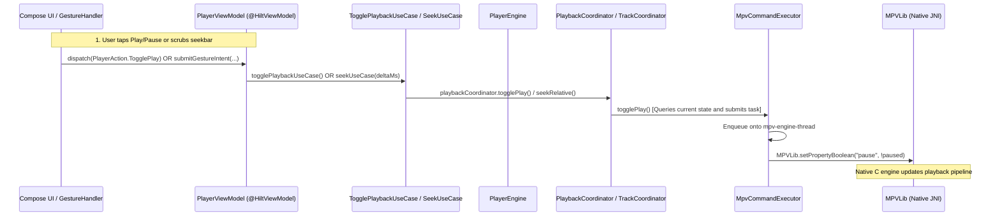
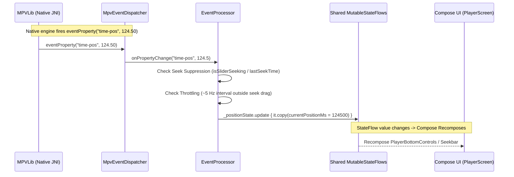
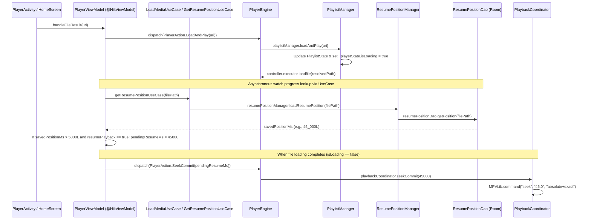
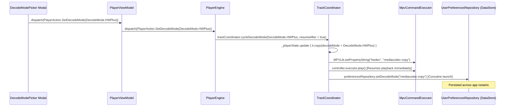

# Potato Player MPV — Comprehensive Codebase Flow & System Architecture Report (`flow.md`)

This report provides a definitive, architectural breakdown of the **Potato Player MPV** codebase following the Phase 1 Structural Refactor. It illustrates how every component interacts, how execution flows through the system, how UI commands and touch gestures map to native `libmpv` JNI calls, and defines the exact leaders governing each subsystem.

---
## 1. Executive Summary: The Leaders of the Codebase

In a reactive Android media application built with **Jetpack Compose**, **StateFlow**, **Clean Architecture**, **Dagger Hilt**, and a native **JNI engine (`libmpv`)**, clear separation of concerns is vital. Following the structural refactoring and dependency injection overhaul, the system is governed by eight distinct **Leader Categories**, each ruling its own architectural domain:

```
+----------------------------------------------------------------------------------------------------+
|                                      THE CODEBASE LEADERS                                          |
+----------------------------------------------------------------------------------------------------+
|                                                                                                    |
|  1. DI & APPLICATION BOOTSTRAP LEADERS                                                             |
|     Files: [PotatoPlayerApp.kt](file:///c:/Users/tapman/Desktop/potatompv%20-%2022/mpvplayer22/app/src/main/java/com/tapman104/mpvplayer/PotatoPlayerApp.kt), [EngineModule.kt](file:///c:/Users/tapman/Desktop/potatompv%20-%2022/mpvplayer22/app/src/main/java/com/tapman104/mpvplayer/di/EngineModule.kt), [MediaModule.kt](file:///c:/Users/tapman/Desktop/potatompv%20-%2022/mpvplayer22/app/src/main/java/com/tapman104/mpvplayer/di/MediaModule.kt), [UseCaseModule.kt](file:///c:/Users/tapman/Desktop/potatompv%20-%2022/mpvplayer22/app/src/main/java/com/tapman104/mpvplayer/di/UseCaseModule.kt),     |
|            [DatabaseModule.kt](file:///c:/Users/tapman/Desktop/potatompv%20-%2022/mpvplayer22/app/src/main/java/com/tapman104/mpvplayer/di/DatabaseModule.kt) & [PreferencesModule.kt](file:///c:/Users/tapman/Desktop/potatompv%20-%2022/mpvplayer22/app/src/main/java/com/tapman104/mpvplayer/di/PreferencesModule.kt)                                       |
|     Role: Governs application lifecycle (`@HiltAndroidApp`), singleton scopes (`AppDatabase`,      |
|           `UserPreferencesRepository`, `PlayerEngine`, `MpvController`, `Coordinators`), and       |
|           `@ViewModelScoped` domain `UseCases` injected into ViewModels.                           |
|                                                                                                    |
|  2. MASTER ACTION ORCHESTRATOR LEADER                                                              |
|     File: [PlayerEngine.kt](file:///c:/Users/tapman/Desktop/potatompv%20-%2022/mpvplayer22/app/src/main/java/com/tapman104/mpvplayer/player/engine/PlayerEngine.kt)                                              |
|     Role: The central hub of the player. Receives all user intents expressed as [PlayerAction.kt](file:///c:/Users/tapman/Desktop/potatompv%20-%2022/mpvplayer22/app/src/main/java/com/tapman104/mpvplayer/player/engine/PlayerAction.kt)   |
|           via `dispatch(action)` and routes them to specialized coordinators and managers.         |
|           Watches `UserPreferencesRepository` coroutines and applies engine-level settings.        |
|                                                                                                    |
|  3. CLEAN ARCHITECTURE DOMAIN LEADERS                                                              |
|     Files: [SeekUseCase.kt](file:///c:/Users/tapman/Desktop/potatompv%20-%2022/mpvplayer22/app/src/main/java/com/tapman104/mpvplayer/player/domain/usecase/SeekUseCase.kt), [TogglePlaybackUseCase.kt](file:///c:/Users/tapman/Desktop/potatompv%20-%2022/mpvplayer22/app/src/main/java/com/tapman104/mpvplayer/player/domain/usecase/TogglePlaybackUseCase.kt), [LoadMediaUseCase.kt](file:///c:/Users/tapman/Desktop/potatompv%20-%2022/mpvplayer22/app/src/main/java/com/tapman104/mpvplayer/player/domain/usecase/LoadMediaUseCase.kt), [SetSpeedUseCase.kt](file:///c:/Users/tapman/Desktop/potatompv%20-%2022/mpvplayer22/app/src/main/java/com/tapman104/mpvplayer/player/domain/usecase/SetSpeedUseCase.kt),  |
|            [SetAudioTrackUseCase.kt](file:///c:/Users/tapman/Desktop/potatompv%20-%2022/mpvplayer22/app/src/main/java/com/tapman104/mpvplayer/player/domain/usecase/SetAudioTrackUseCase.kt), [SetSubtitleTrackUseCase.kt](file:///c:/Users/tapman/Desktop/potatompv%20-%2022/mpvplayer22/app/src/main/java/com/tapman104/mpvplayer/player/domain/usecase/SetSubtitleTrackUseCase.kt), [CycleAspectRatioUseCase.kt](file:///c:/Users/tapman/Desktop/potatompv%20-%2022/mpvplayer22/app/src/main/java/com/tapman104/mpvplayer/player/domain/usecase/CycleAspectRatioUseCase.kt), |
|            [SaveResumePositionUseCase.kt](file:///c:/Users/tapman/Desktop/potatompv%20-%2022/mpvplayer22/app/src/main/java/com/tapman104/mpvplayer/player/domain/usecase/SaveResumePositionUseCase.kt), [GetResumePositionUseCase.kt](file:///c:/Users/tapman/Desktop/potatompv%20-%2022/mpvplayer22/app/src/main/java/com/tapman104/mpvplayer/player/domain/usecase/GetResumePositionUseCase.kt) & [MediaRepository.kt](file:///c:/Users/tapman/Desktop/potatompv%20-%2022/mpvplayer22/app/src/main/java/com/tapman104/mpvplayer/player/domain/repository/MediaRepository.kt)   |
|     Role: Encapsulate domain logic, URI resolution (`LocalMediaRepository`), and command execution |
|           boundaries, keeping `PlayerViewModel` completely decoupled from direct coordinator calls.|
|                                                                                                    |
|  4. COMMAND COORDINATOR & SUB-MANAGER LEADERS                                                      |
|     Files: [PlaybackCoordinator.kt](file:///c:/Users/tapman/Desktop/potatompv%20-%2022/mpvplayer22/app/src/main/java/com/tapman104/mpvplayer/player/viewmodel/PlaybackCoordinator.kt), [TrackCoordinator.kt](file:///c:/Users/tapman/Desktop/potatompv%20-%2022/mpvplayer22/app/src/main/java/com/tapman104/mpvplayer/player/viewmodel/TrackCoordinator.kt), [PlaylistManager.kt](file:///c:/Users/tapman/Desktop/potatompv%20-%2022/mpvplayer22/app/src/main/java/com/tapman104/mpvplayer/player/viewmodel/PlaylistManager.kt),   |
|            [SubtitleController.kt](file:///c:/Users/tapman/Desktop/potatompv%20-%2022/mpvplayer22/app/src/main/java/com/tapman104/mpvplayer/player/viewmodel/SubtitleController.kt) & [ResumePositionManager.kt](file:///c:/Users/tapman/Desktop/potatompv%20-%2022/mpvplayer22/app/src/main/java/com/tapman104/mpvplayer/player/viewmodel/ResumePositionManager.kt)                             |
|     Role: Domain-specific controllers. `PlaybackCoordinator` owns play/pause/seek/volume/speed/    |
|           aspect/zoom. `TrackCoordinator` owns audio selection, subtitle selection/sideloading,    |
|           and hardware decode mode switching (`cycleDecodeMode`). `PlaylistManager` manages queue  |
|           and EOF auto-advance. `ResumePositionManager` handles debounced Room watch progress.     |
|                                                                                                    |
|  5. VIEWMODEL LIFECYCLE BRIDGE LEADER                                                              |
|     File: [PlayerViewModel.kt](file:///c:/Users/tapman/Desktop/potatompv%20-%2022/mpvplayer22/app/src/main/java/com/tapman104/mpvplayer/player/viewmodel/PlayerViewModel.kt)                                           |
|     Role: Thin lifecycle bridge (`@HiltViewModel`) between Android `ViewModel` / Lifecycle and     |
|           `PlayerEngine` & `UseCases`. Exposes StateFlows (`playerState`, `positionState`) to UI.  |
|           Collects [GestureIntent.kt](file:///c:/Users/tapman/Desktop/potatompv%20-%2022/mpvplayer22/app/src/main/java/com/tapman104/mpvplayer/player/gesture/GestureIntent.kt) from gesture interceptors and routes them to `UseCases` or   |
|           `PlayerEngine.dispatch`. Handles screen off (`ACTION_SCREEN_OFF`) & activity pause rules.|
|                                                                                                    |
|  6. NATIVE ENGINE & EVENT PROCESSING LEADERS                                                       |
|     Files: [MpvController.kt](file:///c:/Users/tapman/Desktop/potatompv%20-%2022/mpvplayer22/app/src/main/java/com/tapman104/mpvplayer/core/engine/MpvController.kt), [MpvCommandExecutor.kt](file:///c:/Users/tapman/Desktop/potatompv%20-%2022/mpvplayer22/app/src/main/java/com/tapman104/mpvplayer/core/engine/MpvCommandExecutor.kt), [EventProcessor.kt](file:///c:/Users/tapman/Desktop/potatompv%20-%2022/mpvplayer22/app/src/main/java/com/tapman104/mpvplayer/core/engine/EventProcessor.kt) & [MpvSurface.kt](file:///c:/Users/tapman/Desktop/potatompv%20-%2022/mpvplayer22/app/src/main/java/com/tapman104/mpvplayer/core/engine/MpvSurface.kt)     |
|     Role: Native JNI facade (`MpvController`), single-thread command queue (`MpvCommandExecutor`), |
|           generation-aware surface binding (`MpvSurface`), and high-frequency event processor      |
|           (`EventProcessor`) with ~5 Hz `time-pos` throttling, seek suppression & equality guards. |
|                                                                                                    |
|  7. TOUCH GESTURE & HARDWARE KEY INPUT LEADERS                                                     |
|     Files: [GestureHandler.kt](file:///c:/Users/tapman/Desktop/potatompv%20-%2022/mpvplayer22/app/src/main/java/com/tapman104/mpvplayer/player/gesture/GestureHandler.kt), [MpvGestureStateMachine.kt](file:///c:/Users/tapman/Desktop/potatompv%20-%2022/mpvplayer22/app/src/main/java/com/tapman104/mpvplayer/player/gesture/MpvGestureStateMachine.kt) & [KeyEventHandler.kt](file:///c:/Users/tapman/Desktop/potatompv%20-%2022/mpvplayer22/app/src/main/java/com/tapman104/mpvplayer/player/input/KeyEventHandler.kt)               |
|     Role: `GestureHandler` intercepts Compose touch events, classifies touches via `StateMachine`, |
|           emits `GestureIntent` to `PlayerViewModel`, and hosts visual indicators.                 |
|           `KeyEventHandler` intercepts hardware volume keys (`onKeyDown`/`onKeyUp`) and routes     |
|           volume percentage changes cleanly to `PlayerViewModel`.                                  |
|                                                                                                    |
|  8. PRESENTATION & WINDOW HOST LEADERS                                                             |
|     Files: [PlayerScreen.kt](file:///c:/Users/tapman/Desktop/potatompv%20-%2022/mpvplayer22/app/src/main/java/com/tapman104/mpvplayer/player/playback/PlayerScreen.kt), [PlayerOverlay.kt](file:///c:/Users/tapman/Desktop/potatompv%20-%2022/mpvplayer22/app/src/main/java/com/tapman104/mpvplayer/player/playback/PlayerOverlay.kt) & [PlayerActivity.kt](file:///c:/Users/tapman/Desktop/potatompv%20-%2022/mpvplayer22/app/src/main/java/com/tapman104/mpvplayer/PlayerActivity.kt)                     |
|     Role: `PlayerActivity` (`@AndroidEntryPoint`) provides full-screen window flags, PiP, and      |
|           file pickers. `PlayerScreen` combines `PlayerVideo` (`SurfaceView`), `GestureHandler`,   |
|           and `PlayerOverlay` (control bars, dialogs, quick actions, and 3s auto-hide timer).      |
+----------------------------------------------------------------------------------------------------+
```

---

## 2. System Architecture & 8-Layered Flow Map

The application strictly separates responsibilities across **8 layers**. Commands (`PlayerAction`, `GestureIntent`) flow **downward** from UI through the ViewModel bridge, Domain Use Cases, and Action Orchestrator toward the native engine, while state updates (`StateFlow`) and JNI callbacks (`MpvEventDispatcher`) flow **upward** to trigger Compose recomposition.

```
======================================================================================================
                                      LAYER 1: APPLICATION & WINDOW HOST
======================================================================================================
  [PotatoPlayerApp.kt (`@HiltAndroidApp`)](file:///c:/Users/tapman/Desktop/potatompv%20-%2022/mpvplayer22/app/src/main/java/com/tapman104/mpvplayer/PotatoPlayerApp.kt) ---> [MainActivity.kt (`@AndroidEntryPoint`)](file:///c:/Users/tapman/Desktop/potatompv%20-%2022/mpvplayer22/app/src/main/java/com/tapman104/mpvplayer/MainActivity.kt) <---> [HomeScreen.kt](file:///c:/Users/tapman/Desktop/potatompv%20-%2022/mpvplayer22/app/src/main/java/com/tapman104/mpvplayer/home/ui/HomeScreen.kt) ----(Intent with URI)----> [PlayerActivity.kt (`@AndroidEntryPoint`)](file:///c:/Users/tapman/Desktop/potatompv%20-%2022/mpvplayer22/app/src/main/java/com/tapman104/mpvplayer/PlayerActivity.kt)
                                                                                                     │
                                              (KeyEventHandler / File & Subtitle Pickers / PiP / Window Flags)
                                                                                                     │
                                                                                                     ▼
======================================================================================================
                                 LAYER 2: PRESENTATION & OVERLAY LAYER (Compose)
======================================================================================================
                                          [PlayerScreen.kt](file:///c:/Users/tapman/Desktop/potatompv%20-%2022/mpvplayer22/app/src/main/java/com/tapman104/mpvplayer/player/playback/PlayerScreen.kt)
                                                 │
                 ┌───────────────────────────────┼───────────────────────────────┐
                 ▼                               ▼                               ▼
        [PlayerVideo.kt](file:///c:/Users/tapman/Desktop/potatompv%20-%2022/mpvplayer22/app/src/main/java/com/tapman104/mpvplayer/player/playback/PlayerVideo.kt)                 [PlayerOverlay.kt](file:///c:/Users/tapman/Desktop/potatompv%20-%2022/mpvplayer22/app/src/main/java/com/tapman104/mpvplayer/player/playback/PlayerOverlay.kt)                [GestureHandler.kt](file:///c:/Users/tapman/Desktop/potatompv%20-%2022/mpvplayer22/app/src/main/java/com/tapman104/mpvplayer/player/gesture/GestureHandler.kt)
    (Wraps Android SurfaceView)                  │                 (Intercepts Pointer Input Events)
                 │              ┌────────────────┼────────────────┐              │
                 │              ▼                ▼                ▼              │
                 │       [PlayerTopBar]   [BottomControls]  [QuickActions]       ▼
                 │              │                │                │     [MpvGestureStateMachine.kt](file:///c:/Users/tapman/Desktop/potatompv%20-%2022/mpvplayer22/app/src/main/java/com/tapman104/mpvplayer/player/gesture/MpvGestureStateMachine.kt)
                 │              └────────────────┼────────────────┘     (Mutually Exclusive State Transitions)
                 │                               │                               │
                 │                       User Commands / Clicks                  │ Emits [GestureIntent]
                 │                               │                               ▼
=================│===============================│===============================│====================
                 │            LAYER 3: VIEWMODEL LIFECYCLE BRIDGE (`@HiltViewModel`)             │
=================│===============================│===============================│====================
                 │                               ▼                               │
                 │               [PlayerViewModel.kt (`@HiltViewModel`)](file:///c:/Users/tapman/Desktop/potatompv%20-%2022/mpvplayer22/app/src/main/java/com/tapman104/mpvplayer/player/viewmodel/PlayerViewModel.kt) <───────────┘
                 │            (Collects GestureIntent → Delegates to UseCases / Engine)
                 │                               │
                 │                               ▼
=================│===============================│====================================================
                 │      LAYER 4: CLEAN ARCHITECTURE DOMAIN USE CASES & REPOSITORY                │
=================│===============================│====================================================
                 │                               ▼
                 │ [SeekUseCase] [TogglePlaybackUseCase] [SetSpeedUseCase] [LoadMediaUseCase] [MediaRepository]
                 │       │               │                   │                 │              │
                 │       ▼               ▼                   ▼                 ▼              ▼
=================│===============================│====================================================
                 │       LAYER 5: MASTER ACTION ORCHESTRATOR HUB                 
=================│===============================│====================================================
                 │                               ▼
                 │                [PlayerEngine.kt](file:///c:/Users/tapman/Desktop/potatompv%20-%2022/mpvplayer22/app/src/main/java/com/tapman104/mpvplayer/player/engine/PlayerEngine.kt) [dispatch(PlayerAction)]
                 │                               │
        ┌────────┴───────┬───────────────┬───────┴───────┬───────────────┐
        ▼                ▼               ▼               ▼               ▼
======================================================================================================
                            LAYER 6: COMMAND COORDINATORS & SUB-MANAGERS
======================================================================================================
[PlaybackCoordinator] [TrackCoordinator] [PlaylistManager] [SubtitleController] [ResumePositionManager]
(Play, Pause, Seek,   (Audio/Subtitle    (Queue, Next,     (Subtitle Track  (Debounced Room
 Volume, Speed, Zoom)  Selection/Sideload, Prev, EOF)      Styling, Scale,  Progress Save/Restore)
       │               HW Decode Switch)│       │          Position)        │
       └────────────────┼───────────────┘       │              │            │
                        ▼                       ▼              ▼            ▼
======================================================================================================
                          LAYER 7: NATIVE ENGINE FACADE & COMMAND QUEUE
======================================================================================================
         [MpvController.kt](file:///c:/Users/tapman/Desktop/potatompv%20-%2022/mpvplayer22/app/src/main/java/com/tapman104/mpvplayer/core/engine/MpvController.kt) ──► [MpvCommandExecutor.kt](file:///c:/Users/tapman/Desktop/potatompv%20-%2022/mpvplayer22/app/src/main/java/com/tapman104/mpvplayer/core/engine/MpvCommandExecutor.kt) ──► [is.xyz.mpv.MPVLib (JNI from `app/libs/*.aar`)](file:///c:/Users/tapman/Desktop/potatompv%20-%2022/mpvplayer22/app/build.gradle.kts#L64)
         [MpvSurface.kt](file:///c:/Users/tapman/Desktop/potatompv%20-%2022/mpvplayer22/app/src/main/java/com/tapman104/mpvplayer/core/engine/MpvSurface.kt) (Surface generation checks)                ▲
                        ▲                                                       │
                        │                       JNI Event Callbacks (`observeProperty`)
                        │                                                       │
                        │                                                       ▼
                        │                                        [MpvEventDispatcher.kt](file:///c:/Users/tapman/Desktop/potatompv%20-%2022/mpvplayer22/app/src/main/java/com/tapman104/mpvplayer/core/engine/MpvEventDispatcher.kt)
                        │                                                       │
                        │                                                       ▼
                        │                                        [EventProcessor.kt](file:///c:/Users/tapman/Desktop/potatompv%20-%2022/mpvplayer22/app/src/main/java/com/tapman104/mpvplayer/core/engine/EventProcessor.kt)
                        │                                       (Throttled ~5 Hz / Seek Suppression)
                        │                                                       │
                        │                                                       ▼
                        │                                  Mutates Shared `MutableStateFlow`
                        │                                                       │
========================│───────────────────────────────────────────────────────│=====================
                        │             LAYER 8: PERSISTENCE & STORAGE            │
========================│───────────────────────────────────────────────────────│=====================
                        ▼                                                       ▼
          [AppDatabase.kt (Room DAO)](file:///c:/Users/tapman/Desktop/potatompv%20-%2022/mpvplayer22/app/src/main/java/com/tapman104/mpvplayer/core/database/AppDatabase.kt)                   [UserPreferencesRepository.kt (DataStore)](file:///c:/Users/tapman/Desktop/potatompv%20-%2022/mpvplayer22/app/src/main/java/com/tapman104/mpvplayer/core/preferences/UserPreferencesRepository.kt)
```

---

## 3. Exact Leader Profiles & Responsibilities

### 3.1 Dagger Hilt DI & App Bootstrap Leaders
- **Files**: [PotatoPlayerApp.kt](file:///c:/Users/tapman/Desktop/potatompv%20-%2022/mpvplayer22/app/src/main/java/com/tapman104/mpvplayer/PotatoPlayerApp.kt), [DatabaseModule.kt](file:///c:/Users/tapman/Desktop/potatompv%20-%2022/mpvplayer22/app/src/main/java/com/tapman104/mpvplayer/di/DatabaseModule.kt), [EngineModule.kt](file:///c:/Users/tapman/Desktop/potatompv%20-%2022/mpvplayer22/app/src/main/java/com/tapman104/mpvplayer/di/EngineModule.kt), [MediaModule.kt](file:///c:/Users/tapman/Desktop/potatompv%20-%2022/mpvplayer22/app/src/main/java/com/tapman104/mpvplayer/di/MediaModule.kt), [PreferencesModule.kt](file:///c:/Users/tapman/Desktop/potatompv%20-%2022/mpvplayer22/app/src/main/java/com/tapman104/mpvplayer/di/PreferencesModule.kt) & [UseCaseModule.kt](file:///c:/Users/tapman/Desktop/potatompv%20-%2022/mpvplayer22/app/src/main/java/com/tapman104/mpvplayer/di/UseCaseModule.kt)
- **Core Role**: Initializes Dagger Hilt dependency graph upon application launch and wires all singleton scopes and viewmodel-scoped domain dependencies.
- **Key Providers**:
  - `DatabaseModule`: Provides `@Singleton` `AppDatabase` and `ResumePositionDao`.
  - `EngineModule`: Provides `@Singleton` `MpvController`, `MpvCommandExecutor`, `MpvEventDispatcher`, `PlayerEngine`, `PlaybackCoordinator`, and `TrackCoordinator`.
  - `MediaModule`: Provides `@Singleton` `UriResolver`, `PlaylistManager`, `ResumePositionManager`, and `MediaRepository` (`LocalMediaRepository`).
  - `UseCaseModule`: Provides `@ViewModelScoped` instances of `SeekUseCase`, `TogglePlaybackUseCase`, `LoadMediaUseCase`, `SetSpeedUseCase`, `SetAudioTrackUseCase`, `SetSubtitleTrackUseCase`, `CycleAspectRatioUseCase`, `SaveResumePositionUseCase`, and `GetResumePositionUseCase`.

### 3.2 Clean Architecture Domain Use Cases & Repositories
- **Files**: [SeekUseCase.kt](file:///c:/Users/tapman/Desktop/potatompv%20-%2022/mpvplayer22/app/src/main/java/com/tapman104/mpvplayer/player/domain/usecase/SeekUseCase.kt), [TogglePlaybackUseCase.kt](file:///c:/Users/tapman/Desktop/potatompv%20-%2022/mpvplayer22/app/src/main/java/com/tapman104/mpvplayer/player/domain/usecase/TogglePlaybackUseCase.kt), [LoadMediaUseCase.kt](file:///c:/Users/tapman/Desktop/potatompv%20-%2022/mpvplayer22/app/src/main/java/com/tapman104/mpvplayer/player/domain/usecase/LoadMediaUseCase.kt), [SetSpeedUseCase.kt](file:///c:/Users/tapman/Desktop/potatompv%20-%2022/mpvplayer22/app/src/main/java/com/tapman104/mpvplayer/player/domain/usecase/SetSpeedUseCase.kt), [SetAudioTrackUseCase.kt](file:///c:/Users/tapman/Desktop/potatompv%20-%2022/mpvplayer22/app/src/main/java/com/tapman104/mpvplayer/player/domain/usecase/SetAudioTrackUseCase.kt), [SetSubtitleTrackUseCase.kt](file:///c:/Users/tapman/Desktop/potatompv%20-%2022/mpvplayer22/app/src/main/java/com/tapman104/mpvplayer/player/domain/usecase/SetSubtitleTrackUseCase.kt), [CycleAspectRatioUseCase.kt](file:///c:/Users/tapman/Desktop/potatompv%20-%2022/mpvplayer22/app/src/main/java/com/tapman104/mpvplayer/player/domain/usecase/CycleAspectRatioUseCase.kt), [SaveResumePositionUseCase.kt](file:///c:/Users/tapman/Desktop/potatompv%20-%2022/mpvplayer22/app/src/main/java/com/tapman104/mpvplayer/player/domain/usecase/SaveResumePositionUseCase.kt), [GetResumePositionUseCase.kt](file:///c:/Users/tapman/Desktop/potatompv%20-%2022/mpvplayer22/app/src/main/java/com/tapman104/mpvplayer/player/domain/usecase/GetResumePositionUseCase.kt), [MediaRepository.kt](file:///c:/Users/tapman/Desktop/potatompv%20-%2022/mpvplayer22/app/src/main/java/com/tapman104/mpvplayer/player/domain/repository/MediaRepository.kt) & [LocalMediaRepository.kt](file:///c:/Users/tapman/Desktop/potatompv%20-%2022/mpvplayer22/app/src/main/java/com/tapman104/mpvplayer/player/domain/repository/LocalMediaRepository.kt)
- **Core Role**: Decouple `PlayerViewModel` from direct calls to coordinators and managers by providing discrete, testable actions and repository interfaces.
- **Key Behavior**:
  - `MediaRepository` (`LocalMediaRepository`): Abstracts `UriResolver` resolution and `PlaylistManager` next/previous navigation.
  - `SeekUseCase` / `TogglePlaybackUseCase` / `LoadMediaUseCase` / `SetSpeedUseCase` / `CycleAspectRatioUseCase`: Delegate directly to `PlaybackCoordinator`.
  - `SetAudioTrackUseCase` / `SetSubtitleTrackUseCase`: Delegate directly to `TrackCoordinator`.
  - `SaveResumePositionUseCase` / `GetResumePositionUseCase`: Delegate directly to `ResumePositionManager`.

### 3.3 `PlayerEngine.kt` — Master Action Orchestrator
- **File**: [app/src/main/java/com/tapman104/mpvplayer/player/engine/PlayerEngine.kt](file:///c:/Users/tapman/Desktop/potatompv%20-%2022/mpvplayer22/app/src/main/java/com/tapman104/mpvplayer/player/engine/PlayerEngine.kt)
- **Core Role**: Top-level orchestrator that receives every UI command and delegates to specialized coordinators.
- **Key Methods / Flows**:
  - `dispatch(action: PlayerAction)`: Pattern matches sealed actions (`Play`, `Pause`, `SeekRelative`, `SetVolume`, `SetSpeed`, `SetDecodeMode`, `LoadAndPlay`, `SetAudioTrack`, etc.) and invokes `playbackCoordinator`, `trackCoordinator`, or `playlistManager`.
  - `init {}`: Initializes `MpvController`, attaches `EventProcessor` as listener, sets `onSurfaceReady` callback, and launches coroutines observing user preferences (`decodeMode`, `debandFilter`, `videoScale`, `volumeBoost`, `pitchCorrection`, `audioOutputDriver`).
  - Shared State Factory: Holds the exact `MutableStateFlow<PlayerState>` and `MutableStateFlow<PositionState>` instances shared by reference with `PlaybackCoordinator`, `TrackCoordinator`, and `EventProcessor`.

### 3.4 `PlaybackCoordinator.kt` — Playback Command Coordinator
- **File**: [app/src/main/java/com/tapman104/mpvplayer/player/viewmodel/PlaybackCoordinator.kt](file:///c:/Users/tapman/Desktop/potatompv%20-%2022/mpvplayer22/app/src/main/java/com/tapman104/mpvplayer/player/viewmodel/PlaybackCoordinator.kt)
- **Core Role**: Owns all real-time video/audio playback manipulation logic.
- **Key Methods**:
  - `play()`, `pause()`, `togglePlay()`, `pausePlayback()`: Toggles native `PROP_PAUSE` via `controller.executor`.
  - `seekRelative(offsetMs)`, `seekGestureDrag(positionMs)`, `seekCommit(positionMs)`: Sets `eventProcessor.isSliderSeeking = true/false` to prevent time-pos echo during scrubs, and executes `seekRelativeCoalesced` / `seekCommit` (`absolute+keyframes` vs `absolute+exact`).
  - `setVolume(volume)`: Syncs Android OS `AudioManager.STREAM_MUSIC` and calls `controller.executor.setVolume(volume)`.
  - `setSpeed(speed)`, `setPlaybackSpeedRamped(targetSpeed)`, `restorePlaybackSpeed()`: Manages rate changes and saves `preOverrideSpeed` during long-press 2× speed scrubs.
  - `setAspectRatio(mode)`, `setZoomAndPan(zoomLog2, panX, panY)`: Configures `panscan`, `video-aspect-override`, `video-zoom`, and pan coordinates.

### 3.5 `TrackCoordinator.kt` — Track & Hardware Decode Coordinator
- **File**: [app/src/main/java/com/tapman104/mpvplayer/player/viewmodel/TrackCoordinator.kt](file:///c:/Users/tapman/Desktop/potatompv%20-%2022/mpvplayer22/app/src/main/java/com/tapman104/mpvplayer/player/viewmodel/TrackCoordinator.kt)
- **Core Role**: Manages audio streams, subtitle streams, and hardware decoding mode transitions.
- **Key Methods**:
  - `setAudioTrack(id)`, `setSubtitleTrack(id)`: Sets `aid` and `sid` native properties.
  - `addAudioTrack(uri)`, `addSubtitle(uri)`: Resolves content URIs via `resolveTrackPath(uri)` (using `UriResolver` or local cache fallback) and executes `sub-add` / `audio-add` with `"select"`.
  - `cycleDecodeMode(mode, resumeAfter)`: Switches hardware decoding mode (`mediacodec`, `mediacodec-copy`, `no`), immediately resumes playback (`controller.executor.play()`), mutates shared `_playerState`, and persists selection asynchronously to `preferencesRepository`.

### 3.6 `PlayerViewModel.kt` — Thin Lifecycle Bridge (`@HiltViewModel`)
- **File**: [app/src/main/java/com/tapman104/mpvplayer/player/viewmodel/PlayerViewModel.kt](file:///c:/Users/tapman/Desktop/potatompv%20-%2022/mpvplayer22/app/src/main/java/com/tapman104/mpvplayer/player/viewmodel/PlayerViewModel.kt)
- **Core Role**: Connects Android `AndroidViewModel` and `DefaultLifecycleObserver` contracts to `PlayerEngine` and injected domain `UseCases`.
- **Key Methods**:
  - `dispatch(action: PlayerAction)`: Routes core playback actions directly through `seekUseCase`, `togglePlaybackUseCase`, `setSpeedUseCase`, `setAudioTrackUseCase`, and `setSubtitleTrackUseCase`, while delegating remaining actions to `engine.dispatch(action)`.
  - `submitGestureIntent(intent: GestureIntent)`: Collects intents from `_gestureIntents` (`MutableSharedFlow`) and delegates to `seekUseCase(deltaMs)`, `setSpeedUseCase(speed)`, `togglePlaybackUseCase()`, or `dispatch(PlayerAction.*)`.
  - `onScreenOff()`, `onActivityPause(backgroundPlayPref, isHeadphonesConnected)`: Evaluates background play rules (`off`, `always`, `headphones_only`) when screen turns off or activity pauses, dispatching `PausePlayback` and invoking `saveResumePositionUseCase`.
  - `handleFileResult(uri)`, `handleSubtitleResult(uri)`, `handleAudioTrackResult(uri)`: Routes picker result URIs directly to `PlayerAction.LoadAndPlay`, `AddSubtitle`, `AddAudioTrack`.

### 3.7 `GestureHandler.kt` & `MpvGestureStateMachine.kt` — Touch Governors
- **Files**: [GestureHandler.kt](file:///c:/Users/tapman/Desktop/potatompv%20-%2022/mpvplayer22/app/src/main/java/com/tapman104/mpvplayer/player/gesture/GestureHandler.kt) & [MpvGestureStateMachine.kt](file:///c:/Users/tapman/Desktop/potatompv%20-%2022/mpvplayer22/app/src/main/java/com/tapman104/mpvplayer/player/gesture/MpvGestureStateMachine.kt)
- **Core Role**: Intercept pointer events without ambiguity, classify gestures, and render visual overlays.
- **Key Behavior**:
  - `MpvGestureStateMachine` guarantees strict single-ownership of touch sequences (`Idle` → `TapCandidate` → `MultiTapSeeking` / `VerticalSwipe` / `HorizontalSeek` / `LongPress` / `PinchZoomPan`).
  - `GestureHandler` translates state machine actions into `GestureIntent` emissions (`onIntent(GestureIntent.*)`) and renders `VolumeIndicator`, `BrightnessIndicator`, `SpeedIndicator`, `SeekCircleIndicator`, and `PinchZoomIndicator`.

### 3.8 `KeyEventHandler.kt` — Hardware Key Interceptor
- **File**: [app/src/main/java/com/tapman104/mpvplayer/player/input/KeyEventHandler.kt](file:///c:/Users/tapman/Desktop/potatompv%20-%2022/mpvplayer22/app/src/main/java/com/tapman104/mpvplayer/player/input/KeyEventHandler.kt)
- **Core Role**: Keeps hardware volume keys cleanly decoupled from `PlayerActivity`.
- **Key Behavior**: Checks `isVolumeKey(keyCode)` (`KEYCODE_VOLUME_UP`, `KEYCODE_VOLUME_DOWN`, `KEYCODE_VOLUME_MUTE`). Allows system `AudioManager` to adjust stream volume, then calculates exact volume percentage (`0..100`) and invokes `onVolumeSync(pct)`, which dispatches `PlayerAction.SetVolume(pct)`.

---

## 4. End-to-End Execution Pipelines & Sequence Flows

### 4.1 Pipeline A: UI Command / Gesture to Native Execution

When a user interacts with a control button or completes a gesture, the intent travels through the action/use-case pipeline down to the native thread:



---

### 4.2 Pipeline B: Native JNI Property Callback to Compose Recomposition

Native property changes triggered by playback progress (`time-pos`), stream metadata (`track-list`), or state changes travel upward through `EventProcessor`:



---

### 4.3 Pipeline C: Media Loading & Watch Progress Restoration

When a video file is selected from `HomeScreen` or an external file picker:



---

### 4.4 Pipeline D: Hardware Decode Mode Switch (`cycleDecodeMode`)

When a user selects a hardware decode card (`HW`, `HW+`, `SW`) in `DecodeModePicker`:



---

## 5. State Mutability & Concurrency Governance

To guarantee high performance and avoid race conditions across multi-threaded JNI boundaries and Compose UI rendering, the codebase enforces four strict concurrency invariants:

### 5.1 Shared MutableStateFlow Identity
`PlayerEngine` instantiates two master state stores upon creation:
```kotlin
sharedPlayerState: MutableStateFlow<PlayerState> = MutableStateFlow(PlayerState())
sharedPositionState: MutableStateFlow<PositionState> = MutableStateFlow(PositionState())
```
These exact instances are passed by reference into `PlaybackCoordinator`, `TrackCoordinator`, and `EventProcessor`. All layers read from and mutate the exact same underlying `StateFlow`. This guarantees zero state divergence between JNI callbacks (`EventProcessor`) and UI command executions (`Coordinators`).

### 5.2 Single-Thread Safe Command Execution (`MpvCommandExecutor`)
Native `libmpv` APIs are not thread-safe and must never be invoked concurrently from arbitrary coroutines or UI threads. `MpvCommandExecutor` enforces serialization onto a dedicated handler thread (`mpv-engine-thread`):
```kotlin
private val handlerThread = HandlerThread("mpv-engine-thread").apply { start() }
private val handler = Handler(handlerThread.looper)

fun execute(block: () -> Unit) {
    if (Looper.myLooper() == handler.looper) {
        block()
    } else {
        handler.post { block() }
    }
}
```

### 5.3 High-Frequency Throttling & Seek Suppression (`EventProcessor`)
During playback, `libmpv` emits `time-pos` property notifications at up to ~60 Hz. Updating Compose state at 60 Hz causes excessive recomposition overhead and UI stuttering. `EventProcessor` enforces two safeguards:
1. **Time-Pos Throttling**: Updates to `PositionState.currentPositionMs` are throttled to **~5 Hz (`200 ms` interval)** during normal playback unless a major jump occurs (`delta > 1000 ms` or `delta < 0`).
2. **Seek Echo Suppression**: While dragging the seekbar or scrubbing (`isSliderSeeking == true`), `EventProcessor` ignores native `time-pos` callbacks until `SeekCommit` is fired. This prevents the seekbar slider from jittering or snapping backward against the user's thumb while coalesced seek commands (`seekRelativeCoalesced`) are executing.

### 5.4 Generation-Aware Surface Binding (`MpvSurface`)
When rotating the device or entering/exiting Picture-in-Picture, Android destroys and recreates `SurfaceView`. To prevent race conditions where commands detach a newly recreated surface, `MpvCommandExecutor` tracks surface generations (`nextSurfaceGeneration()`) and only executes `detachSurface(generation)` if the generation ID still matches the active surface.
