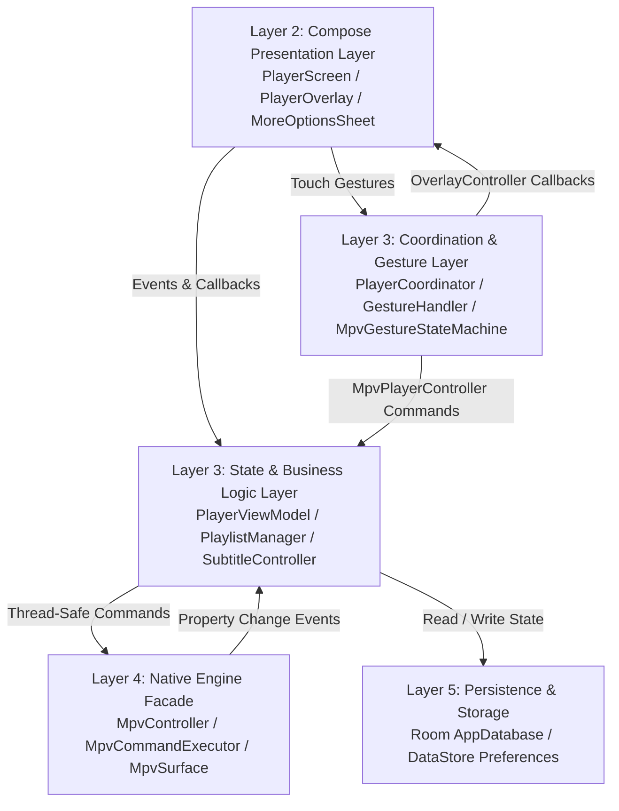

# Potato Player MPV — Complete Codebase Map (`map.md`)

Welcome to the **Potato Player MPV** Codebase Map. This document provides a structural directory tree, module map, and file reference for navigating the entire repository.

---

## 1. Directory Tree & Package Structure

```
c:\Users\tapman\Desktop\potatompv\mpvplayer\
├── app/src/main/java/com/tapman104/mpvplayer/
│   ├── MainActivity.kt                     # Application launcher & entry point
│   ├── PlayerActivity.kt                   # Dedicated full-screen playback Activity
│   ├── core/
│   │   ├── database/                       # Room SQLite persistence layer
│   │   │   ├── AppDatabase.kt              # Room Database configuration & DAO provider
│   │   │   ├── ResumePositionDao.kt        # Data Access Object for watch progress
│   │   │   └── ResumePositionEntity.kt     # SQLite entity for saved timestamps
│   │   ├── engine/                         # Native JNI libmpv engine abstraction
│   │   │   ├── MpvCommandExecutor.kt       # Single-thread safe command queue & seek debouncer
│   │   │   ├── MpvConstants.kt             # Static libmpv property & command constants
│   │   │   ├── MpvController.kt            # High-level engine lifecycle & playback facade
│   │   │   ├── MpvEventDispatcher.kt       # Native JNI event dispatcher & listener contract
│   │   │   ├── MpvOptionsConfigurator.kt   # Pre-init VO/GPU & font asset configurator
│   │   │   ├── MpvSurface.kt               # Generation-aware Android Surface wrapper
│   │   │   └── TrackListParser.kt          # JSON/property parser for audio & subtitle tracks
│   │   └── preferences/                    # Android DataStore preference storage
│   │       └── UserPreferencesRepository.kt # Persistent hardware decode & styling store
│   ├── home/ui/
│   │   └── HomeScreen.kt                   # Home screen media launcher UI
│   ├── player/
│   │   ├── controls/                       # On-screen player control bars & styles
│   │   │   ├── PlayerBottomControls.kt     # Bottom bar with interactive seekbar & preview
│   │   │   ├── PlayerControlsStyles.kt     # Shared glassmorphic design tokens & icon buttons
│   │   │   ├── PlayerQuickActions.kt       # Quick toggle bar (aspect ratio, hwdec, more options)
│   │   │   └── PlayerTopBar.kt             # Header bar with file title & track pickers
│   │   ├── coordinator/                    # Bridge between gestures, overlays & viewmodel
│   │   │   ├── OverlayController.kt        # Interface contract for visual gesture overlays
│   │   │   └── PlayerCoordinator.kt        # MpvPlayerController implementation & overlay router
│   │   ├── dialog/                         # Styling & hardware decode dialogs
│   │   │   ├── DecodeModePicker.kt         # HW / HW+ / SW decode selector modal
│   │   │   └── SubtitleAppearanceDialog.kt # Subtitle scale & position slider modal
│   │   ├── dialogs/                        # Track selector & side sheet modals
│   │   │   ├── AudioTrackDialog.kt         # Audio stream picker modal
│   │   │   ├── MoreOptionsSheet.kt         # Side sheet for speed chips, FileInfo & settings
│   │   │   └── SubtitleTrackDialog.kt      # Subtitle track selector & file sideload modal
│   │   ├── gesture/                        # Multi-touch gesture engine
│   │   │   ├── GestureHandler.kt           # Compose touch interceptor & overlay host
│   │   │   ├── GestureIndicators.kt        # Volume, brightness, seek & zoom visual overlays
│   │   │   ├── GestureModels.kt            # Domain models, MpvPlayerController & state definitions
│   │   │   └── MpvGestureStateMachine.kt   # Single-ownership mutually exclusive touch classifier
│   │   ├── model/                          # Domain data classes & enums
│   │   │   ├── AspectRatioMode.kt          # Aspect ratio enum definitions
│   │   │   ├── AudioTrack.kt               # Audio track domain model
│   │   │   ├── DecodeMode.kt               # Hardware decoding enum definitions
│   │   │   ├── FileInfo.kt                 # Media metadata model (duration, path, track counts)
│   │   │   └── SubtitleTrack.kt            # Subtitle track domain model
│   │   ├── playback/                       # Compose playback viewport & overlay root
│   │   │   ├── PlayerOverlay.kt            # Master overlay stack & auto-hide coordinator
│   │   │   ├── PlayerScreen.kt             # Root screen layout (video + gestures + controls)
│   │   │   └── PlayerVideo.kt              # AndroidView wrapper hosting SurfaceView
│   │   ├── state/                          # Immutable UI StateFlow models
│   │   │   ├── PlayerState.kt              # Core playback UI state model
│   │   │   ├── PlaylistState.kt            # Playlist queue & index state model
│   │   │   └── SubtitleAppearanceState.kt  # Subtitle styling state model
│   │   └── viewmodel/                      # Business logic & state orchestration
│   │       ├── PlayerViewModel.kt          # Supreme player brain & equality-guarded state emitter
│   │       ├── PlayerViewModelFactory.kt   # Dependency injection factory
│   │       ├── PlaylistManager.kt          # Playlist queue & EOF auto-advance manager
│   │       ├── ResumePositionManager.kt    # Watch progress auto-saver & restorer
│   │       └── SubtitleController.kt       # Subtitle track & appearance coordinator
│   ├── settings/                           # Application Settings hub
│   │   ├── AboutSection.kt                 # App version & info settings card
│   │   ├── SettingsScreen.kt               # Root settings Compose screen
│   │   ├── SettingsViewModel.kt            # Settings ViewModel
│   │   └── SubtitleAppearanceSection.kt    # Subtitle styling preferences card
│   ├── ui/theme/                           # Material Design 3 Design System
│   │   ├── Color.kt                        # App color palette definitions
│   │   ├── Theme.kt                        # MaterialTheme wrapper
│   │   └── Type.kt                         # Typography scale definitions
│   └── util/                               # Core utility helpers
│       ├── TimeFormatter.kt                # HH:MM:SS timestamp formatter
│       └── UriResolver.kt                  # Content URI to file descriptor/path resolver
└── flow.md                                 # Comprehensive codebase architecture & flow report
```

---

## 2. Complete File Reference Table

| Package Area | File & Clickable Link | Core Purpose | Key Collaborators |
| :--- | :--- | :--- | :--- |
| **App Entry** | [MainActivity.kt](file:///c:/Users/tapman/Desktop/potatompv/mpvplayer/app/src/main/java/com/tapman104/mpvplayer/MainActivity.kt) | Application entry point & navigation host | `HomeScreen`, `SettingsScreen` |
| **App Entry** | [PlayerActivity.kt](file:///c:/Users/tapman/Desktop/potatompv/mpvplayer/app/src/main/java/com/tapman104/mpvplayer/PlayerActivity.kt) | Dedicated full-screen video playback activity | `PlayerViewModel`, `PlayerScreen`, `PlayerCoordinator` |
| **Core Database** | [AppDatabase.kt](file:///c:/Users/tapman/Desktop/potatompv/mpvplayer/app/src/main/java/com/tapman104/mpvplayer/core/database/AppDatabase.kt) | Room database initialization & DAO provider | `ResumePositionDao` |
| **Core Database** | [ResumePositionDao.kt](file:///c:/Users/tapman/Desktop/potatompv/mpvplayer/app/src/main/java/com/tapman104/mpvplayer/core/database/ResumePositionDao.kt) | Room DAO for CRUD operations on playback timestamps | `ResumePositionEntity` |
| **Core Database** | [ResumePositionEntity.kt](file:///c:/Users/tapman/Desktop/potatompv/mpvplayer/app/src/main/java/com/tapman104/mpvplayer/core/database/ResumePositionEntity.kt) | SQLite entity storing file path, position, and duration | Room Database |
| **Core Engine** | [MpvController.kt](file:///c:/Users/tapman/Desktop/potatompv/mpvplayer/app/src/main/java/com/tapman104/mpvplayer/core/engine/MpvController.kt) | Native libmpv engine facade & lifecycle governor | `MpvCommandExecutor`, `MpvEventDispatcher`, `MpvOptionsConfigurator` |
| **Core Engine** | [MpvCommandExecutor.kt](file:///c:/Users/tapman/Desktop/potatompv/mpvplayer/app/src/main/java/com/tapman104/mpvplayer/core/engine/MpvCommandExecutor.kt) | Single-thread safe engine command executor & seek debouncer | `MPVLib` (JNI), `MpvSurface` |
| **Core Engine** | [MpvEventDispatcher.kt](file:///c:/Users/tapman/Desktop/potatompv/mpvplayer/app/src/main/java/com/tapman104/mpvplayer/core/engine/MpvEventDispatcher.kt) | JNI callback router broadcasting native property events | `MpvEventListener` |
| **Core Engine** | [MpvOptionsConfigurator.kt](file:///c:/Users/tapman/Desktop/potatompv/mpvplayer/app/src/main/java/com/tapman104/mpvplayer/core/engine/MpvOptionsConfigurator.kt) | Configures initial VO, GPU options & font assets | `MPVLib`, Android Assets |
| **Core Engine** | [MpvSurface.kt](file:///c:/Users/tapman/Desktop/potatompv/mpvplayer/app/src/main/java/com/tapman104/mpvplayer/core/engine/MpvSurface.kt) | Generation-aware Android surface binding manager | `MpvCommandExecutor` |
| **Core Engine** | [MpvConstants.kt](file:///c:/Users/tapman/Desktop/potatompv/mpvplayer/app/src/main/java/com/tapman104/mpvplayer/core/engine/MpvConstants.kt) | Static libmpv property & command string tokens | Global Engine & ViewModel |
| **Core Engine** | [TrackListParser.kt](file:///c:/Users/tapman/Desktop/potatompv/mpvplayer/app/src/main/java/com/tapman104/mpvplayer/core/engine/TrackListParser.kt) | Parses native track-list strings into Kotlin track models | `AudioTrack`, `SubtitleTrack` |
| **Core Preferences** | [UserPreferencesRepository.kt](file:///c:/Users/tapman/Desktop/potatompv/mpvplayer/app/src/main/java/com/tapman104/mpvplayer/core/preferences/UserPreferencesRepository.kt) | Android DataStore for hardware decode mode & subtitle styling | `PlayerViewModel`, `SettingsViewModel` |
| **Player ViewModel** | [PlayerViewModel.kt](file:///c:/Users/tapman/Desktop/potatompv/mpvplayer/app/src/main/java/com/tapman104/mpvplayer/player/viewmodel/PlayerViewModel.kt) | Central state brain with equality-guarded property updates | `MpvController`, `PlaylistManager`, `SubtitleController` |
| **Player ViewModel** | [PlayerViewModelFactory.kt](file:///c:/Users/tapman/Desktop/potatompv/mpvplayer/app/src/main/java/com/tapman104/mpvplayer/player/viewmodel/PlayerViewModelFactory.kt) | ViewModel dependency injection factory | `AppDatabase`, `UserPreferencesRepository` |
| **Player ViewModel** | [PlaylistManager.kt](file:///c:/Users/tapman/Desktop/potatompv/mpvplayer/app/src/main/java/com/tapman104/mpvplayer/player/viewmodel/PlaylistManager.kt) | Queue orchestrator handling EOF auto-advance | `PlayerViewModel`, `PlaylistState` |
| **Player ViewModel** | [SubtitleController.kt](file:///c:/Users/tapman/Desktop/potatompv/mpvplayer/app/src/main/java/com/tapman104/mpvplayer/player/viewmodel/SubtitleController.kt) | Subtitle track selection, sideloading & styling controller | `PlayerViewModel`, `UserPreferencesRepository` |
| **Player ViewModel** | [ResumePositionManager.kt](file:///c:/Users/tapman/Desktop/potatompv/mpvplayer/app/src/main/java/com/tapman104/mpvplayer/player/viewmodel/ResumePositionManager.kt) | Debounced playback progress persistence manager | `ResumePositionDao` |
| **Player Coordinator** | [PlayerCoordinator.kt](file:///c:/Users/tapman/Desktop/potatompv/mpvplayer/app/src/main/java/com/tapman104/mpvplayer/player/coordinator/PlayerCoordinator.kt) | Bridge implementing `MpvPlayerController` & overlay router | `PlayerViewModel`, `OverlayController` |
| **Player Coordinator** | [OverlayController.kt](file:///c:/Users/tapman/Desktop/potatompv/mpvplayer/app/src/main/java/com/tapman104/mpvplayer/player/coordinator/OverlayController.kt) | Interface contract for showing/hiding gesture feedback overlays | `PlayerOverlay`, `PlayerCoordinator` |
| **Player Gesture** | [GestureHandler.kt](file:///c:/Users/tapman/Desktop/potatompv/mpvplayer/app/src/main/java/com/tapman104/mpvplayer/player/gesture/GestureHandler.kt) | Compose touch interceptor & indicator overlay host | `MpvGestureStateMachine`, `PlayerCoordinator` |
| **Player Gesture** | [MpvGestureStateMachine.kt](file:///c:/Users/tapman/Desktop/potatompv/mpvplayer/app/src/main/java/com/tapman104/mpvplayer/player/gesture/MpvGestureStateMachine.kt) | Mutually exclusive touch sequence state machine | `GestureModels`, `MpvPlayerController` |
| **Player Gesture** | [GestureModels.kt](file:///c:/Users/tapman/Desktop/potatompv/mpvplayer/app/src/main/java/com/tapman104/mpvplayer/player/gesture/GestureModels.kt) | Touch state sealed classes & `MpvPlayerController` contract | `MpvGestureStateMachine` |
| **Player Gesture** | [GestureIndicators.kt](file:///c:/Users/tapman/Desktop/potatompv/mpvplayer/app/src/main/java/com/tapman104/mpvplayer/player/gesture/GestureIndicators.kt) | Visual feedback indicators (volume, brightness, seek, zoom) | Compose UI, Material 3 |
| **Player Playback** | [PlayerScreen.kt](file:///c:/Users/tapman/Desktop/potatompv/mpvplayer/app/src/main/java/com/tapman104/mpvplayer/player/playback/PlayerScreen.kt) | Root compose playback layout & settings wiring | `PlayerVideo`, `PlayerOverlay` |
| **Player Playback** | [PlayerOverlay.kt](file:///c:/Users/tapman/Desktop/potatompv/mpvplayer/app/src/main/java/com/tapman104/mpvplayer/player/playback/PlayerOverlay.kt) | Stacks controls, gestures, dialogs & auto-hide timer | `PlayerTopBar`, `PlayerBottomControls`, `MoreOptionsSheet` |
| **Player Playback** | [PlayerVideo.kt](file:///c:/Users/tapman/Desktop/potatompv/mpvplayer/app/src/main/java/com/tapman104/mpvplayer/player/playback/PlayerVideo.kt) | AndroidView wrapper hosting SurfaceView for mpv | `MpvSurface` |
| **Player Controls** | [PlayerBottomControls.kt](file:///c:/Users/tapman/Desktop/potatompv/mpvplayer/app/src/main/java/com/tapman104/mpvplayer/player/controls/PlayerBottomControls.kt) | Bottom playback bar with interactive scrubbing seekbar | `PlayerViewModel`, `TimeFormatter` |
| **Player Controls** | [PlayerQuickActions.kt](file:///c:/Users/tapman/Desktop/potatompv/mpvplayer/app/src/main/java/com/tapman104/mpvplayer/player/controls/PlayerQuickActions.kt) | Quick toggle bar (aspect ratio, hwdec, more options 3-dot) | `PlayerViewModel`, `PlayerControlsStyles` |
| **Player Controls** | [PlayerTopBar.kt](file:///c:/Users/tapman/Desktop/potatompv/mpvplayer/app/src/main/java/com/tapman104/mpvplayer/player/controls/PlayerTopBar.kt) | Header bar with file title, audio/subtitle selectors | `PlayerActivity` |
| **Player Controls** | [PlayerControlsStyles.kt](file:///c:/Users/tapman/Desktop/potatompv/mpvplayer/app/src/main/java/com/tapman104/mpvplayer/player/controls/PlayerControlsStyles.kt) | Shared glassmorphic design modifiers & icon buttons | All control bars |
| **Player Dialogs** | [MoreOptionsSheet.kt](file:///c:/Users/tapman/Desktop/potatompv/mpvplayer/app/src/main/java/com/tapman104/mpvplayer/player/dialogs/MoreOptionsSheet.kt) | Side sheet for speed chips, FileInfo inspection & settings | `PlayerOverlay`, `FileInfo` |
| **Player Dialogs** | [AudioTrackDialog.kt](file:///c:/Users/tapman/Desktop/potatompv/mpvplayer/app/src/main/java/com/tapman104/mpvplayer/player/dialogs/AudioTrackDialog.kt) | Modal dialog for switching audio streams | `PlayerViewModel` |
| **Player Dialogs** | [SubtitleTrackDialog.kt](file:///c:/Users/tapman/Desktop/potatompv/mpvplayer/app/src/main/java/com/tapman104/mpvplayer/player/dialogs/SubtitleTrackDialog.kt) | Modal dialog for subtitle selection & external sideloading | `PlayerViewModel` |
| **Player Dialogs** | [DecodeModePicker.kt](file:///c:/Users/tapman/Desktop/potatompv/mpvplayer/app/src/main/java/com/tapman104/mpvplayer/player/dialog/DecodeModePicker.kt) | Hardware decode selector card modal (`HW`/`HW+`/`SW`) | `PlayerViewModel`, `DecodeMode` |
| **Player Dialogs** | [SubtitleAppearanceDialog.kt](file:///c:/Users/tapman/Desktop/potatompv/mpvplayer/app/src/main/java/com/tapman104/mpvplayer/player/dialog/SubtitleAppearanceDialog.kt) | Subtitle scale & position slider modal | `SubtitleController` |
| **Player Models** | [FileInfo.kt](file:///c:/Users/tapman/Desktop/potatompv/mpvplayer/app/src/main/java/com/tapman104/mpvplayer/player/model/FileInfo.kt) | Immutable media metadata model | `MoreOptionsSheet` |
| **Player Models** | [AudioTrack.kt](file:///c:/Users/tapman/Desktop/potatompv/mpvplayer/app/src/main/java/com/tapman104/mpvplayer/player/model/AudioTrack.kt) & [SubtitleTrack.kt](file:///c:/Users/tapman/Desktop/potatompv/mpvplayer/app/src/main/java/com/tapman104/mpvplayer/player/model/SubtitleTrack.kt) | Track metadata models | `TrackListParser` |
| **Player Models** | [DecodeMode.kt](file:///c:/Users/tapman/Desktop/potatompv/mpvplayer/app/src/main/java/com/tapman104/mpvplayer/player/model/DecodeMode.kt) & [AspectRatioMode.kt](file:///c:/Users/tapman/Desktop/potatompv/mpvplayer/app/src/main/java/com/tapman104/mpvplayer/player/model/AspectRatioMode.kt) | Decoding & aspect ratio enums | `PlayerQuickActions`, `DecodeModePicker` |
| **Player State** | [PlayerState.kt](file:///c:/Users/tapman/Desktop/potatompv/mpvplayer/app/src/main/java/com/tapman104/mpvplayer/player/state/PlayerState.kt) | Central immutable playback UI state model | `PlayerViewModel`, UI screens |
| **Settings** | [SettingsScreen.kt](file:///c:/Users/tapman/Desktop/potatompv/mpvplayer/app/src/main/java/com/tapman104/mpvplayer/settings/SettingsScreen.kt) & [SettingsViewModel.kt](file:///c:/Users/tapman/Desktop/potatompv/mpvplayer/app/src/main/java/com/tapman104/mpvplayer/settings/SettingsViewModel.kt) | Global application settings UI & state manager | `UserPreferencesRepository` |
| **Utilities** | [UriResolver.kt](file:///c:/Users/tapman/Desktop/potatompv/mpvplayer/app/src/main/java/com/tapman104/mpvplayer/util/UriResolver.kt) & [TimeFormatter.kt](file:///c:/Users/tapman/Desktop/potatompv/mpvplayer/app/src/main/java/com/tapman104/mpvplayer/util/TimeFormatter.kt) | URI file resolution & timestamp formatting | `PlayerActivity`, `PlayerBottomControls` |

---

## 3. Architecture Layer Dependency Flow



---

## 4. Key Documentation Files
* [flow.md](file:///c:/Users/tapman/Desktop/potatompv/mpvplayer/flow.md) — Comprehensive architecture breakdown, execution pipelines, and design decisions.
* [map.md](file:///c:/Users/tapman/Desktop/potatompv/mpvplayer/map.md) — This quick-reference directory and structural codebase map.
