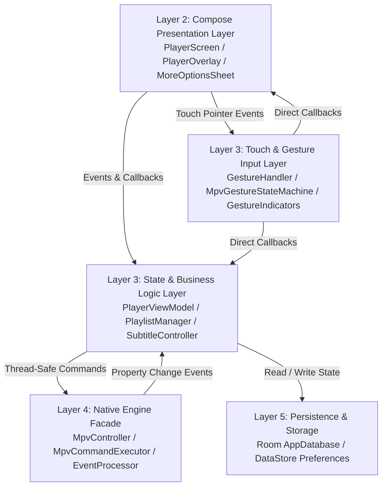
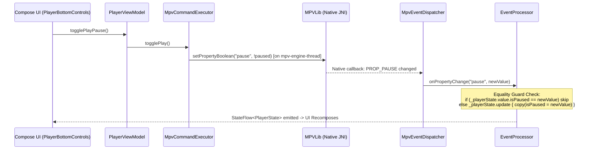

# Potato Player MPV — Complete Codebase Map (`map.md`)

Welcome to the **Potato Player MPV** Codebase Map. This document provides a definitive structural directory tree, comprehensive module map, exact file reference table, user interaction flowcharts, gesture state machine matrix, and native libmpv property registry for the entire repository.

---

## 1. Directory Tree & Package Structure

```
c:\Users\tapman\Desktop\potatompv\mpvplayer\
├── app/src/main/java/com/tapman104/mpvplayer/
│   ├── MainActivity.kt                     # Application launcher & entry point
│   ├── PlayerActivity.kt                   # Dedicated full-screen playback Activity with window flags & receivers
│   ├── core/
│   │   ├── database/                       # Room SQLite persistence layer
│   │   │   ├── AppDatabase.kt              # Room Database configuration & DAO provider
│   │   │   ├── ResumePositionDao.kt        # Data Access Object for watch progress CRUD queries
│   │   │   └── ResumePositionEntity.kt     # SQLite entity storing file path, position & duration
│   │   ├── engine/                         # Native C/JNI libmpv engine abstraction
│   │   │   ├── EventProcessor.kt           # Native event processor with throttled time-pos (~5 Hz) & seek suppression
│   │   │   ├── MpvCommandExecutor.kt       # Thread-safe command queue & coalesced seek debouncer
│   │   │   ├── MpvConstants.kt             # Static libmpv property & command string literals
│   │   │   ├── MpvController.kt            # High-level engine lifecycle & playback facade
│   │   │   ├── MpvEventDispatcher.kt       # Native JNI event dispatcher & listener contract
│   │   │   ├── MpvOptionsConfigurator.kt   # Pre-init VO/GPU context & bundled font asset configurator
│   │   │   ├── MpvSurface.kt               # Generation-aware Android Surface wrapper
│   │   │   └── TrackListParser.kt          # JSON/property parser for audio & subtitle tracks
│   │   └── preferences/                    # Android DataStore preference storage
│   │       └── UserPreferencesRepository.kt # Persistent hardware decode, gesture & styling store
│   ├── home/ui/
│   │   └── HomeScreen.kt                   # Home screen media launcher UI
│   ├── player/
│   │   ├── controls/                       # On-screen player control bars & design tokens
│   │   │   ├── PlayerBottomControls.kt     # Bottom bar with interactive seekbar & drag preview
│   │   │   ├── PlayerControlsStyles.kt     # Shared glassmorphic design tokens & icon buttons
│   │   │   ├── PlayerQuickActions.kt       # Quick toggle bar (aspect ratio, hwdec, more options)
│   │   │   └── PlayerTopBar.kt             # Header bar with file title & track pickers
│   │   ├── dialog/                         # Styling & hardware decode dialogs
│   │   │   ├── DecodeModePicker.kt         # HW / HW+ / SW decode selector modal
│   │   │   └── SubtitleAppearanceDialog.kt # Subtitle scale & position slider modal
│   │   ├── dialogs/                        # Track selector & side sheet modals
│   │   │   ├── AudioTrackDialog.kt         # Audio stream picker modal
│   │   │   ├── MoreOptionsSheet.kt         # Side sheet for speed chips, FileInfo & settings
│   │   │   └── SubtitleTrackDialog.kt      # Subtitle track selector & file sideload modal
│   │   ├── gesture/                        # Multi-touch gesture engine
│   │   │   ├── GestureHandler.kt           # Compose touch interceptor & overlay host
│   │   │   ├── GestureIndicators.kt        # Volume, brightness, seek & zoom visual overlays
│   │   │   ├── GestureModels.kt            # Domain models, MpvPlayerController & state definitions
│   │   │   └── MpvGestureStateMachine.kt   # Single-ownership mutually exclusive touch classifier
│   │   ├── model/                          # Domain data classes & enums
│   │   │   ├── AspectRatioMode.kt          # Aspect ratio enum definitions
│   │   │   ├── AudioTrack.kt               # Audio track domain model
│   │   │   ├── DecodeMode.kt               # Hardware decoding enum definitions
│   │   │   ├── FileInfo.kt                 # Media metadata model (duration, path, track counts)
│   │   │   └── SubtitleTrack.kt            # Subtitle track domain model
│   │   ├── playback/                       # Compose playback viewport & overlay root
│   │   │   ├── PlayerOverlay.kt            # Master overlay stack & auto-hide timer coordinator
│   │   │   ├── PlayerScreen.kt             # Root screen layout (video + gestures + controls)
│   │   │   └── PlayerVideo.kt              # AndroidView wrapper hosting SurfaceView
│   │   ├── state/                          # Immutable UI StateFlow models
│   │   │   ├── PlayerState.kt              # Core playback UI state model
│   │   │   ├── PlaylistState.kt            # Playlist queue & index state model
│   │   │   └── SubtitleAppearanceState.kt  # Subtitle styling state model
│   │   └── viewmodel/                      # Business logic & state orchestration
│   │       ├── PlayerViewModel.kt          # Supreme player brain & equality-guarded state emitter
│   │       ├── PlayerViewModelFactory.kt   # Dependency injection factory
│   │       ├── PlaylistManager.kt          # Playlist queue & EOF auto-advance manager
│   │       ├── ResumePositionManager.kt    # Watch progress auto-saver & restorer
│   │       └── SubtitleController.kt       # Subtitle track & appearance coordinator
│   ├── settings/                           # Application Settings hub
│   │   ├── AboutSection.kt                 # App version & info settings card
│   │   ├── SettingsScreen.kt               # Root settings Compose screen
│   │   ├── SettingsViewModel.kt            # Settings ViewModel
│   │   └── SubtitleAppearanceSection.kt    # Subtitle styling preferences card
│   ├── ui/theme/                           # Material Design 3 Design System
│   │   ├── Color.kt                        # App color palette definitions
│   │   ├── Theme.kt                        # MaterialTheme wrapper
│   │   └── Type.kt                         # Typography scale definitions
│   └── util/                               # Core utility helpers
│       ├── TimeFormatter.kt                # HH:MM:SS timestamp formatter
│       └── UriResolver.kt                  # Content URI to file descriptor/path resolver
├── app/src/test/java/com/tapman104/mpvplayer/
│   ├── core/engine/
│   │   └── EventProcessorTest.kt           # EventProcessor state sync, time-pos throttling & seek suppression test suite
│   ├── player/gesture/
│   │   ├── GestureStateCoverageTest.kt     # 100% state transition verification
│   │   └── MpvGestureStateMachineTest.kt   # Touch classifier & multi-touch gesture test suite
│   ├── player/model/
│   │   └── DecodeModeTest.kt               # Hardware decode mapping verification
│   └── player/viewmodel/
│       └── PlayerViewModelPropertyChangeTest.kt # Reactive equality-guarded state update test suite
├── flow.md                                 # Comprehensive codebase architecture & flow report
└── map.md                                  # Complete codebase map (this document)
```

---

## 2. Complete File Reference Table

| Package Area | File & Clickable Link | Core Purpose | Key Methods / Properties | Key Collaborators |
| :--- | :--- | :--- | :--- | :--- |
| **App Entry** | [MainActivity.kt](file:///c:/Users/tapman/Desktop/potatompv/mpvplayer/app/src/main/java/com/tapman104/mpvplayer/MainActivity.kt) | Application launcher & navigation host | `onCreate()`, navigation graph | `HomeScreen`, `SettingsScreen` |
| **App Entry** | [PlayerActivity.kt](file:///c:/Users/tapman/Desktop/potatompv/mpvplayer/app/src/main/java/com/tapman104/mpvplayer/PlayerActivity.kt) | Full-screen video playback activity managing immersive window bars, screen-off receivers, and `FLAG_KEEP_SCREEN_ON` | `onCreate()`, `screenOffReceiver`, `updateWindowBrightness`, `filePickerLauncher` | `PlayerViewModel`, `PlayerScreen`, `PlayerCoordinator` |
| **Core Database** | [AppDatabase.kt](file:///c:/Users/tapman/Desktop/potatompv/mpvplayer/app/src/main/java/com/tapman104/mpvplayer/core/database/AppDatabase.kt) | Room SQLite database initialization & DAO provider | `resumePositionDao()` | `ResumePositionDao` |
| **Core Database** | [ResumePositionDao.kt](file:///c:/Users/tapman/Desktop/potatompv/mpvplayer/app/src/main/java/com/tapman104/mpvplayer/core/database/ResumePositionDao.kt) | Room DAO for playback progress queries | `savePosition()`, `getPosition()`, `deletePosition()` | `ResumePositionEntity` |
| **Core Database** | [ResumePositionEntity.kt](file:///c:/Users/tapman/Desktop/potatompv/mpvplayer/app/src/main/java/com/tapman104/mpvplayer/core/database/ResumePositionEntity.kt) | SQLite entity storing file path, timestamp & duration | `filePath`, `positionMs`, `durationMs` | Room Database |
| **Core Engine** | [EventProcessor.kt](file:///c:/Users/tapman/Desktop/potatompv/mpvplayer/app/src/main/java/com/tapman104/mpvplayer/core/engine/EventProcessor.kt) | Native event processor managing playback states, throttled time-pos updates (~5 Hz), and slider seek suppression | `onFileLoaded()`, `onPlaybackStarted()`, `onPlaybackStopped()`, `onPropertyChange()` | `MpvEventDispatcher`, `PlayerViewModel` |
| **Core Engine** | [MpvController.kt](file:///c:/Users/tapman/Desktop/potatompv/mpvplayer/app/src/main/java/com/tapman104/mpvplayer/core/engine/MpvController.kt) | Native libmpv engine facade & lifecycle governor | `init()`, `destroy()`, `copyFontAsset()` | `MpvCommandExecutor`, `MpvEventDispatcher`, `MpvOptionsConfigurator` |
| **Core Engine** | [MpvCommandExecutor.kt](file:///c:/Users/tapman/Desktop/potatompv/mpvplayer/app/src/main/java/com/tapman104/mpvplayer/core/engine/MpvCommandExecutor.kt) | Single-thread safe command queue & coalesced seek debouncer | `execute()`, `seekGesture()`, `seekCommit()`, `nextSurfaceGeneration()` | `MPVLib` (JNI), `MpvSurface` |
| **Core Engine** | [MpvEventDispatcher.kt](file:///c:/Users/tapman/Desktop/potatompv/mpvplayer/app/src/main/java/com/tapman104/mpvplayer/core/engine/MpvEventDispatcher.kt) | JNI callback router broadcasting native property events | `eventProperty()`, `addListener()`, `removeListener()` | `MpvEventListener` |
| **Core Engine** | [MpvOptionsConfigurator.kt](file:///c:/Users/tapman/Desktop/potatompv/mpvplayer/app/src/main/java/com/tapman104/mpvplayer/core/engine/MpvOptionsConfigurator.kt) | Pre-init VO/GPU & font asset configurator | `initOptions()`, `copyFontAssets()` | `MPVLib`, Android Assets |
| **Core Engine** | [MpvSurface.kt](file:///c:/Users/tapman/Desktop/potatompv/mpvplayer/app/src/main/java/com/tapman104/mpvplayer/core/engine/MpvSurface.kt) | Generation-aware Android surface binding manager | `surfaceCreated()`, `surfaceDestroyed()`, `setVo()` | `MpvCommandExecutor` |
| **Core Engine** | [MpvConstants.kt](file:///c:/Users/tapman/Desktop/potatompv/mpvplayer/app/src/main/java/com/tapman104/mpvplayer/core/engine/MpvConstants.kt) | Static libmpv property & command string literals | `PROP_PAUSE`, `PROP_TIME_POS`, `PROP_HWDEC`, etc. | Global Engine & ViewModel |
| **Core Engine** | [TrackListParser.kt](file:///c:/Users/tapman/Desktop/potatompv/mpvplayer/app/src/main/java/com/tapman104/mpvplayer/core/engine/TrackListParser.kt) | Parses native track-list JSON/strings into Kotlin models | `parseTrackList()` | `AudioTrack`, `SubtitleTrack` |
| **Core Preferences** | [UserPreferencesRepository.kt](file:///c:/Users/tapman/Desktop/potatompv/mpvplayer/app/src/main/java/com/tapman104/mpvplayer/core/preferences/UserPreferencesRepository.kt) | DataStore for hardware decode mode, gesture settings & styling | `updateDecodeMode()`, `updateSubtitleSize()`, flows | `PlayerViewModel`, `SettingsViewModel` |
| **Player ViewModel** | [PlayerViewModel.kt](file:///c:/Users/tapman/Desktop/potatompv/mpvplayer/app/src/main/java/com/tapman104/mpvplayer/player/viewmodel/PlayerViewModel.kt) | Supreme player brain with equality-guarded property updates | `play()`, `pause()`, `seekTo()`, `setSpeed()`, `onPropertyChange()` | `MpvController`, `PlaylistManager`, `SubtitleController` |
| **Player ViewModel** | [PlayerViewModelFactory.kt](file:///c:/Users/tapman/Desktop/potatompv/mpvplayer/app/src/main/java/com/tapman104/mpvplayer/player/viewmodel/PlayerViewModelFactory.kt) | Dependency injection factory for PlayerViewModel | `create()` | `AppDatabase`, `UserPreferencesRepository` |
| **Player ViewModel** | [PlaylistManager.kt](file:///c:/Users/tapman/Desktop/potatompv/mpvplayer/app/src/main/java/com/tapman104/mpvplayer/player/viewmodel/PlaylistManager.kt) | Playlist queue & EOF auto-advance manager | `loadAndPlay()`, `playNext()`, `onEndOfFile()` | `PlayerViewModel`, `PlaylistState` |
| **Player ViewModel** | [SubtitleController.kt](file:///c:/Users/tapman/Desktop/potatompv/mpvplayer/app/src/main/java/com/tapman104/mpvplayer/player/viewmodel/SubtitleController.kt) | Subtitle track selection, sideloading & styling controller | `selectTrack()`, `addSubtitleFile()`, `setSubtitleAppearance()` | `PlayerViewModel`, `UserPreferencesRepository` |
| **Player ViewModel** | [ResumePositionManager.kt](file:///c:/Users/tapman/Desktop/potatompv/mpvplayer/app/src/main/java/com/tapman104/mpvplayer/player/viewmodel/ResumePositionManager.kt) | Debounced playback progress persistence manager | `savePosition()`, `getResumePosition()`, `clearPosition()` | `ResumePositionDao` |
| **Player Gesture** | [GestureHandler.kt](file:///c:/Users/tapman/Desktop/potatompv/mpvplayer/app/src/main/java/com/tapman104/mpvplayer/player/gesture/GestureHandler.kt) | Compose touch interceptor implementing `MpvPlayerController` & visual indicator overlay host | `GestureHandler(...)`, `pointerInput(stateMachine)` | `MpvGestureStateMachine`, `PlayerOverlay` |
| **Player Gesture** | [MpvGestureStateMachine.kt](file:///c:/Users/tapman/Desktop/potatompv/mpvplayer/app/src/main/java/com/tapman104/mpvplayer/player/gesture/MpvGestureStateMachine.kt) | Mutually exclusive touch sequence state machine | `onPointerDown()`, `onPointerMove()`, `onPointerUp()`, `transitionTo()` | `GestureModels`, `MpvPlayerController` |
| **Player Gesture** | [GestureModels.kt](file:///c:/Users/tapman/Desktop/potatompv/mpvplayer/app/src/main/java/com/tapman104/mpvplayer/player/gesture/GestureModels.kt) | Touch state sealed classes & `MpvPlayerController` contract | `MpvPlayerController`, `GestureState` sealed classes | `MpvGestureStateMachine` |
| **Player Gesture** | [GestureIndicators.kt](file:///c:/Users/tapman/Desktop/potatompv/mpvplayer/app/src/main/java/com/tapman104/mpvplayer/player/gesture/GestureIndicators.kt) | Visual feedback indicators (volume, brightness, seek, zoom) | `VolumeIndicator`, `BrightnessIndicator`, `SpeedIndicator`, `IndicatorPill` | Compose UI, Material 3 |
| **Player Playback** | [PlayerScreen.kt](file:///c:/Users/tapman/Desktop/potatompv/mpvplayer/app/src/main/java/com/tapman104/mpvplayer/player/playback/PlayerScreen.kt) | Root compose playback layout & settings wiring | `PlayerScreen(...)` | `PlayerVideo`, `PlayerOverlay` |
| **Player Playback** | [PlayerOverlay.kt](file:///c:/Users/tapman/Desktop/potatompv/mpvplayer/app/src/main/java/com/tapman104/mpvplayer/player/playback/PlayerOverlay.kt) | Stacks controls, gestures, dialogs & auto-hide timer | `PlayerOverlay(...)` | `PlayerTopBar`, `PlayerBottomControls`, `MoreOptionsSheet` |
| **Player Playback** | [PlayerVideo.kt](file:///c:/Users/tapman/Desktop/potatompv/mpvplayer/app/src/main/java/com/tapman104/mpvplayer/player/playback/PlayerVideo.kt) | AndroidView wrapper hosting SurfaceView for mpv | `PlayerVideo(...)` | `MpvSurface` |
| **Player Controls** | [PlayerBottomControls.kt](file:///c:/Users/tapman/Desktop/potatompv/mpvplayer/app/src/main/java/com/tapman104/mpvplayer/player/controls/PlayerBottomControls.kt) | Bottom playback bar with interactive scrubbing seekbar | `PlayerBottomControls(...)`, slider drag preview | `PlayerViewModel`, `TimeFormatter` |
| **Player Controls** | [PlayerQuickActions.kt](file:///c:/Users/tapman/Desktop/potatompv/mpvplayer/app/src/main/java/com/tapman104/mpvplayer/player/controls/PlayerQuickActions.kt) | Quick toggle bar (aspect ratio, hwdec, more options 3-dot) | `PlayerQuickActions(...)` | `PlayerViewModel`, `PlayerControlsStyles` |
| **Player Controls** | [PlayerTopBar.kt](file:///c:/Users/tapman/Desktop/potatompv/mpvplayer/app/src/main/java/com/tapman104/mpvplayer/player/controls/PlayerTopBar.kt) | Header bar with file title, audio/subtitle selectors | `PlayerTopBar(...)` | `PlayerActivity` |
| **Player Controls** | [PlayerControlsStyles.kt](file:///c:/Users/tapman/Desktop/potatompv/mpvplayer/app/src/main/java/com/tapman104/mpvplayer/player/controls/PlayerControlsStyles.kt) | Shared glassmorphic design modifiers & icon buttons | `PlayerIconButton(...)`, `controlBarBackground` | All control bars |
| **Player Dialogs** | [MoreOptionsSheet.kt](file:///c:/Users/tapman/Desktop/potatompv/mpvplayer/app/src/main/java/com/tapman104/mpvplayer/player/dialogs/MoreOptionsSheet.kt) | Side sheet for speed chips, FileInfo inspection & settings | `MoreOptionsSheet(...)` | `PlayerOverlay`, `FileInfo` |
| **Player Dialogs** | [AudioTrackDialog.kt](file:///c:/Users/tapman/Desktop/potatompv/mpvplayer/app/src/main/java/com/tapman104/mpvplayer/player/dialogs/AudioTrackDialog.kt) | Modal dialog for switching audio streams | `AudioTrackDialog(...)` | `PlayerViewModel` |
| **Player Dialogs** | [SubtitleTrackDialog.kt](file:///c:/Users/tapman/Desktop/potatompv/mpvplayer/app/src/main/java/com/tapman104/mpvplayer/player/dialogs/SubtitleTrackDialog.kt) | Modal dialog for subtitle selection & external sideloading | `SubtitleTrackDialog(...)` | `PlayerViewModel` |
| **Player Dialogs** | [DecodeModePicker.kt](file:///c:/Users/tapman/Desktop/potatompv/mpvplayer/app/src/main/java/com/tapman104/mpvplayer/player/dialog/DecodeModePicker.kt) | Hardware decode selector card modal (`HW`/`HW+`/`SW`) | `DecodeModePicker(...)` | `PlayerViewModel`, `DecodeMode` |
| **Player Dialogs** | [SubtitleAppearanceDialog.kt](file:///c:/Users/tapman/Desktop/potatompv/mpvplayer/app/src/main/java/com/tapman104/mpvplayer/player/dialog/SubtitleAppearanceDialog.kt) | Subtitle scale & position slider modal | `SubtitleAppearanceDialog(...)` | `SubtitleController` |
| **Player Models** | [FileInfo.kt](file:///c:/Users/tapman/Desktop/potatompv/mpvplayer/app/src/main/java/com/tapman104/mpvplayer/player/model/FileInfo.kt) | Immutable media metadata model | `fileName`, `filePath`, `durationMs`, track counts | `MoreOptionsSheet` |
| **Player Models** | [AudioTrack.kt](file:///c:/Users/tapman/Desktop/potatompv/mpvplayer/app/src/main/java/com/tapman104/mpvplayer/player/model/AudioTrack.kt) & [SubtitleTrack.kt](file:///c:/Users/tapman/Desktop/potatompv/mpvplayer/app/src/main/java/com/tapman104/mpvplayer/player/model/SubtitleTrack.kt) | Track metadata models | `id`, `name`, `lang`, `isSelected` | `TrackListParser` |
| **Player Models** | [DecodeMode.kt](file:///c:/Users/tapman/Desktop/potatompv/mpvplayer/app/src/main/java/com/tapman104/mpvplayer/player/model/DecodeMode.kt) & [AspectRatioMode.kt](file:///c:/Users/tapman/Desktop/potatompv/mpvplayer/app/src/main/java/com/tapman104/mpvplayer/player/model/AspectRatioMode.kt) | Decoding & aspect ratio enums | `mpvValue`, enum entries | `PlayerQuickActions`, `DecodeModePicker` |
| **Player State** | [PlayerState.kt](file:///c:/Users/tapman/Desktop/potatompv/mpvplayer/app/src/main/java/com/tapman104/mpvplayer/player/state/PlayerState.kt) | Central immutable playback UI state model | `isPaused`, `speed`, `volume`, `durationMs` | `PlayerViewModel`, UI screens |
| **Settings** | [SettingsScreen.kt](file:///c:/Users/tapman/Desktop/potatompv/mpvplayer/app/src/main/java/com/tapman104/mpvplayer/settings/SettingsScreen.kt) & [SettingsViewModel.kt](file:///c:/Users/tapman/Desktop/potatompv/mpvplayer/app/src/main/java/com/tapman104/mpvplayer/settings/SettingsViewModel.kt) | Global application settings UI & state manager | `SettingsScreen(...)`, `update*()` | `UserPreferencesRepository` |
| **Utilities** | [UriResolver.kt](file:///c:/Users/tapman/Desktop/potatompv/mpvplayer/app/src/main/java/com/tapman104/mpvplayer/util/UriResolver.kt) & [TimeFormatter.kt](file:///c:/Users/tapman/Desktop/potatompv/mpvplayer/app/src/main/java/com/tapman104/mpvplayer/util/TimeFormatter.kt) | URI file resolution & timestamp formatting | `resolveUri()`, `formatTime()` | `PlayerActivity`, `PlayerBottomControls` |
| **Tests** | [EventProcessorTest.kt](file:///c:/Users/tapman/Desktop/potatompv/mpvplayer/app/src/test/java/com/tapman104/mpvplayer/core/engine/EventProcessorTest.kt) | Unit test suite verifying EventProcessor state updates, pause synchronization, time-pos throttling (~5 Hz), and seek suppression | `@Test` methods for event processing | `EventProcessor` |
| **Tests** | [MpvGestureStateMachineTest.kt](file:///c:/Users/tapman/Desktop/potatompv/mpvplayer/app/src/test/java/com/tapman104/mpvplayer/player/gesture/MpvGestureStateMachineTest.kt) | Touch classifier & multi-touch gesture test suite | `@Test` methods for gestures | `MpvGestureStateMachine` |
| **Tests** | [GestureStateCoverageTest.kt](file:///c:/Users/tapman/Desktop/potatompv/mpvplayer/app/src/test/java/com/tapman104/mpvplayer/player/gesture/GestureStateCoverageTest.kt) | 100% mutually exclusive state transition coverage test | `@Test` state transition verify | `GestureState` |
| **Tests** | [DecodeModeTest.kt](file:///c:/Users/tapman/Desktop/potatompv/mpvplayer/app/src/test/java/com/tapman104/mpvplayer/player/model/DecodeModeTest.kt) | Hardware decode enum & libmpv mapping verify | `@Test verifyMpvValues` | `DecodeMode` |
| **Tests** | [PlayerViewModelPropertyChangeTest.kt](file:///c:/Users/tapman/Desktop/potatompv/mpvplayer/app/src/test/java/com/tapman104/mpvplayer/player/viewmodel/PlayerViewModelPropertyChangeTest.kt) | Reactive equality-guarded state update test suite | `@Test onPropertyChange_pause` | `PlayerViewModel` |

---

## 3. Architecture Layer Dependency & Reactive Equality Flow

### 3.1 Layer & Component Dependency Graph



### 3.2 Native JNI Event & Equality-Guarded State Loop



---

## 4. User Interaction Flowcharts

Every user interaction—from multi-touch gestures to UI button presses to system events—is mapped below with exact file ownership and threading context.

---

### 4.1 Single Tap — Toggle Controls Visibility

```
User taps video viewport once
        │
        ▼
[GestureHandler.kt](file:///c:/Users/tapman/Desktop/potatompv/mpvplayer/app/src/main/java/com/tapman104/mpvplayer/player/gesture/GestureHandler.kt) (pointerInput interceptor)
        │  finger down → [MpvGestureStateMachine.kt](file:///c:/Users/tapman/Desktop/potatompv/mpvplayer/app/src/main/java/com/tapman104/mpvplayer/player/gesture/MpvGestureStateMachine.kt): state = TapCandidate
        │  finger up   → no move, no second tap within TAP_TIMEOUT_MS
        │                → state = Idle
        ▼
[GestureHandler.kt](file:///c:/Users/tapman/Desktop/potatompv/mpvplayer/app/src/main/java/com/tapman104/mpvplayer/player/gesture/GestureHandler.kt) (MpvPlayerController.triggerSingleTapAction)
        │
        ▼
[PlayerOverlay.kt](file:///c:/Users/tapman/Desktop/potatompv/mpvplayer/app/src/main/java/com/tapman104/mpvplayer/player/playback/PlayerOverlay.kt) (onToggleControls callback -> controlsVisible toggle)
        │  if hidden  → show controls + restart auto-hide timer (3s)
        │  if visible → hide controls immediately
        ▼
Compose recomposition: TopBar / BottomControls / QuickActions fade in/out
```

---

### 4.2 Double Tap — Seek Jump (Left / Right Edge)

```
User double-taps left edge (<30% width)         User double-taps right edge (>70% width)
        │                                               │
        ▼                                               ▼
[GestureHandler.kt](file:///c:/Users/tapman/Desktop/potatompv/mpvplayer/app/src/main/java/com/tapman104/mpvplayer/player/gesture/GestureHandler.kt)                             [GestureHandler.kt](file:///c:/Users/tapman/Desktop/potatompv/mpvplayer/app/src/main/java/com/tapman104/mpvplayer/player/gesture/GestureHandler.kt)
        │  2nd tap within TAP_TIMEOUT_MS               │  same
        │  → state = MultiTapSeeking                    │  state = MultiTapSeeking
        │  side = LEFT                                  │  side = RIGHT
        ▼                                               ▼
[GestureHandler.kt](file:///c:/Users/tapman/Desktop/potatompv/mpvplayer/app/src/main/java/com/tapman104/mpvplayer/player/gesture/GestureHandler.kt) → seekBackward(10_000)            [GestureHandler.kt](file:///c:/Users/tapman/Desktop/potatompv/mpvplayer/app/src/main/java/com/tapman104/mpvplayer/player/gesture/GestureHandler.kt) → seekForward(10_000)
        │                                               │
        ▼                                               ▼
[PlayerOverlay.kt](file:///c:/Users/tapman/Desktop/potatompv/mpvplayer/app/src/main/java/com/tapman104/mpvplayer/player/playback/PlayerOverlay.kt) → onSeekBackward(10_000)          [PlayerOverlay.kt](file:///c:/Users/tapman/Desktop/potatompv/mpvplayer/app/src/main/java/com/tapman104/mpvplayer/player/playback/PlayerOverlay.kt) → onSeekForward(10_000)
        │
        ▼
[PlayerViewModel.kt](file:///c:/Users/tapman/Desktop/potatompv/mpvplayer/app/src/main/java/com/tapman104/mpvplayer/player/viewmodel/PlayerViewModel.kt) → seekRelative(±10_000 ms)
        │
        ▼
[MpvCommandExecutor.kt](file:///c:/Users/tapman/Desktop/potatompv/mpvplayer/app/src/main/java/com/tapman104/mpvplayer/core/engine/MpvCommandExecutor.kt) → execute { MPVLib.command("seek", "±10.0", "relative") } [mpv-engine-thread]

Side effect → [GestureIndicators.kt](file:///c:/Users/tapman/Desktop/potatompv/mpvplayer/app/src/main/java/com/tapman104/mpvplayer/player/gesture/GestureIndicators.kt): left/right SeekCircleIndicator ripple + label
```

---

### 4.3 Long Press — Dynamic Speed Scrub (Hold & Release)

```
User presses and holds finger > LONG_PRESS_TIMEOUT_MS
        │
        ▼
[MpvGestureStateMachine.kt](file:///c:/Users/tapman/Desktop/potatompv/mpvplayer/app/src/main/java/com/tapman104/mpvplayer/player/gesture/MpvGestureStateMachine.kt) state = LongPress → DynamicSpeedScrub
        │
        ▼
[GestureHandler.kt](file:///c:/Users/tapman/Desktop/potatompv/mpvplayer/app/src/main/java/com/tapman104/mpvplayer/player/gesture/GestureHandler.kt).setPlaybackSpeedRamped(targetSpeed = 2.0f)
        │  → onSpeedOverride(2.0f) callback
        │  → [PlayerViewModel.kt](file:///c:/Users/tapman/Desktop/potatompv/mpvplayer/app/src/main/java/com/tapman104/mpvplayer/player/viewmodel/PlayerViewModel.kt).setSpeed(2.0f)
        │  → [MpvCommandExecutor.kt](file:///c:/Users/tapman/Desktop/potatompv/mpvplayer/app/src/main/java/com/tapman104/mpvplayer/core/engine/MpvCommandExecutor.kt).setSpeed(2.0)
        │  → MPVLib.setPropertyDouble("speed", 2.0) [mpv-engine-thread]
        │
        ▼
[GestureIndicators.kt](file:///c:/Users/tapman/Desktop/potatompv/mpvplayer/app/src/main/java/com/tapman104/mpvplayer/player/gesture/GestureIndicators.kt): SpeedIndicator overlay shown ("2.0×")

User lifts finger
        │
        ▼
[GestureHandler.kt](file:///c:/Users/tapman/Desktop/potatompv/mpvplayer/app/src/main/java/com/tapman104/mpvplayer/player/gesture/GestureHandler.kt).restorePlaybackSpeed()
        │  → onSpeedRestore() callback
        │  → [PlayerViewModel.kt](file:///c:/Users/tapman/Desktop/potatompv/mpvplayer/app/src/main/java/com/tapman104/mpvplayer/player/viewmodel/PlayerViewModel.kt).setSpeed(1.0f)
        │  → MPVLib.setPropertyDouble("speed", 1.0)
```

---

### 4.4 Vertical Swipe — Volume (Right Edge) / Brightness (Left Edge)

```
User places finger on edge, vertical delta > threshold (dx < dy)
        │
        ▼
[MpvGestureStateMachine.kt](file:///c:/Users/tapman/Desktop/potatompv/mpvplayer/app/src/main/java/com/tapman104/mpvplayer/player/gesture/MpvGestureStateMachine.kt) state = VerticalSwipe
        │  right half (>50% width) → VOLUME channel
        │  left half  (<50% width) → BRIGHTNESS channel
        ▼
        ├─[VOLUME]─────────────────────────────────────────────────────────────
        │   [GestureHandler.kt](file:///c:/Users/tapman/Desktop/potatompv/mpvplayer/app/src/main/java/com/tapman104/mpvplayer/player/gesture/GestureHandler.kt).setVolume(newVolume)
        │   → audioManager.setStreamVolume(...) & onVolumeChange(pct)
        │   → [GestureIndicators.kt](file:///c:/Users/tapman/Desktop/potatompv/mpvplayer/app/src/main/java/com/tapman104/mpvplayer/player/gesture/GestureIndicators.kt): VolumeIndicator bar
        │
        └─[BRIGHTNESS]──────────────────────────────────────────────────────────
            [GestureHandler.kt](file:///c:/Users/tapman/Desktop/potatompv/mpvplayer/app/src/main/java/com/tapman104/mpvplayer/player/gesture/GestureHandler.kt).setBrightness(clamped)
            → onBrightnessChange.invoke(clamped)
            → [PlayerActivity.kt](file:///c:/Users/tapman/Desktop/potatompv/mpvplayer/PlayerActivity.kt): window.attributes.screenBrightness = clamped
            → [GestureIndicators.kt](file:///c:/Users/tapman/Desktop/potatompv/mpvplayer/app/src/main/java/com/tapman104/mpvplayer/player/gesture/GestureIndicators.kt): BrightnessIndicator bar
```

---

### 4.5 Horizontal Swipe — Seek Scrub

```
User swipes horizontally across viewport (dx > dy)
        │
        ▼
[MpvGestureStateMachine.kt](file:///c:/Users/tapman/Desktop/potatompv/mpvplayer/app/src/main/java/com/tapman104/mpvplayer/player/gesture/MpvGestureStateMachine.kt) state = HorizontalSeek
        │
        ▼
[GestureHandler.kt](file:///c:/Users/tapman/Desktop/potatompv/mpvplayer/app/src/main/java/com/tapman104/mpvplayer/player/gesture/GestureHandler.kt).seekGestureDrag(targetPositionMs)
        │  → onSeekGestureDrag(targetPositionMs) callback
        │  → [PlayerViewModel.kt](file:///c:/Users/tapman/Desktop/potatompv/mpvplayer/app/src/main/java/com/tapman104/mpvplayer/player/viewmodel/PlayerViewModel.kt).seekGesture(targetPositionMs)
        │  → [MpvCommandExecutor.kt](file:///c:/Users/tapman/Desktop/potatompv/mpvplayer/app/src/main/java/com/tapman104/mpvplayer/core/engine/MpvCommandExecutor.kt).seekGesture(seconds) [Coalesced keyframe seek]
        ▼
MPVLib.command("seek", targetSeconds, "absolute+keyframes") [mpv-engine-thread]

User lifts finger
        │
        ▼
[GestureHandler.kt](file:///c:/Users/tapman/Desktop/potatompv/mpvplayer/app/src/main/java/com/tapman104/mpvplayer/player/gesture/GestureHandler.kt).seekCommit(finalPositionMs)
        │  → onSeekCommit(finalPositionMs) callback
        │  → [MpvCommandExecutor.kt](file:///c:/Users/tapman/Desktop/potatompv/mpvplayer/app/src/main/java/com/tapman104/mpvplayer/core/engine/MpvCommandExecutor.kt).seekCommit(finalSeconds)
        ▼
MPVLib.command("seek", finalSeconds, "absolute+exact") [mpv-engine-thread]
```

---

### 4.6 Pinch — Zoom & Pan

```
Two fingers placed on screen, spread apart or pan
        │
        ▼
[MpvGestureStateMachine.kt](file:///c:/Users/tapman/Desktop/potatompv/mpvplayer/app/src/main/java/com/tapman104/mpvplayer/player/gesture/MpvGestureStateMachine.kt) pointerCount = 2, state = PinchZoomPan
        │
        ▼
[GestureHandler.kt](file:///c:/Users/tapman/Desktop/potatompv/mpvplayer/app/src/main/java/com/tapman104/mpvplayer/player/gesture/GestureHandler.kt).setZoomAndPan(zoomLog2, panX, panY)
        │  → onZoomChange(zoomLog2) callback
        ▼
[MpvCommandExecutor.kt](file:///c:/Users/tapman/Desktop/potatompv/mpvplayer/app/src/main/java/com/tapman104/mpvplayer/core/engine/MpvCommandExecutor.kt)
        │  → MPVLib.setPropertyDouble("video-zoom", zoomLog2)
        │  → MPVLib.setPropertyDouble("video-pan-x", panX)
        │  → MPVLib.setPropertyDouble("video-pan-y", panY) [mpv-engine-thread]
```

---

### 4.7 Seekbar Drag — Bottom Controls Scrub

```
User drags seekbar thumb in [PlayerBottomControls.kt](file:///c:/Users/tapman/Desktop/potatompv/mpvplayer/app/src/main/java/com/tapman104/mpvplayer/player/controls/PlayerBottomControls.kt)
        │
        ▼
Slider onValueChange callback (onSeekGesture)
        │  → [PlayerViewModel.kt](file:///c:/Users/tapman/Desktop/potatompv/mpvplayer/app/src/main/java/com/tapman104/mpvplayer/player/viewmodel/PlayerViewModel.kt).seekGesture(positionMs)
        │  → [MpvCommandExecutor.kt](file:///c:/Users/tapman/Desktop/potatompv/mpvplayer/app/src/main/java/com/tapman104/mpvplayer/core/engine/MpvCommandExecutor.kt).seekGesture(seconds) [absolute+keyframes]
        ▼
Slider onValueChangeFinished callback (onSeekCommitMs)
        │  → [PlayerViewModel.kt](file:///c:/Users/tapman/Desktop/potatompv/mpvplayer/app/src/main/java/com/tapman104/mpvplayer/player/viewmodel/PlayerViewModel.kt).seekCommit(positionMs)
        ▼
[MpvCommandExecutor.kt](file:///c:/Users/tapman/Desktop/potatompv/mpvplayer/app/src/main/java/com/tapman104/mpvplayer/core/engine/MpvCommandExecutor.kt).seekCommit(seconds) [absolute+exact]
```

---

### 4.8 Play / Pause Button

```
User taps Play/Pause icon in [PlayerBottomControls.kt](file:///c:/Users/tapman/Desktop/potatompv/mpvplayer/app/src/main/java/com/tapman104/mpvplayer/player/controls/PlayerBottomControls.kt)
        │
        ▼
onTogglePlay() → [PlayerViewModel.kt](file:///c:/Users/tapman/Desktop/potatompv/mpvplayer/app/src/main/java/com/tapman104/mpvplayer/player/viewmodel/PlayerViewModel.kt).togglePlay()
        │
        ▼
[MpvCommandExecutor.kt](file:///c:/Users/tapman/Desktop/potatompv/mpvplayer/app/src/main/java/com/tapman104/mpvplayer/core/engine/MpvCommandExecutor.kt).togglePlay()
        │  reads current PROP_PAUSE and sets MPVLib.setPropertyBoolean("pause", !paused)
        ▼
Native JNI event fires → [MpvEventDispatcher.kt](file:///c:/Users/tapman/Desktop/potatompv/mpvplayer/app/src/main/java/com/tapman104/mpvplayer/core/engine/MpvEventDispatcher.kt) → onPropertyChange("pause", newValue)
        │
        ▼
Equality Guard: if (_playerState.value.isPaused != newValue) _playerState.update { ... }
```

---

### 4.9 Aspect Ratio Cycle

```
User taps [AR] chip in [PlayerQuickActions.kt](file:///c:/Users/tapman/Desktop/potatompv/mpvplayer/app/src/main/java/com/tapman104/mpvplayer/player/controls/PlayerQuickActions.kt)
        │
        ▼
onAspectRatioClick() → [PlayerViewModel.kt](file:///c:/Users/tapman/Desktop/potatompv/mpvplayer/app/src/main/java/com/tapman104/mpvplayer/player/viewmodel/PlayerViewModel.kt).cycleAspectRatio()
        │  cycles: FIT → FILL → 4:3 → 16:9 → FIT
        ▼
[MpvCommandExecutor.kt](file:///c:/Users/tapman/Desktop/potatompv/mpvplayer/app/src/main/java/com/tapman104/mpvplayer/core/engine/MpvCommandExecutor.kt) → MPVLib.setPropertyString("video-aspect-override", mode.mpvValue)
```

---

### 4.10 Hardware Decode Mode — Quick Toggle Chip

```
User taps decode chip in [PlayerQuickActions.kt](file:///c:/Users/tapman/Desktop/potatompv/mpvplayer/app/src/main/java/com/tapman104/mpvplayer/player/controls/PlayerQuickActions.kt) → opens [DecodeModePicker.kt](file:///c:/Users/tapman/Desktop/potatompv/mpvplayer/app/src/main/java/com/tapman104/mpvplayer/player/dialog/DecodeModePicker.kt)
        │
        ▼
User selects card (HW / HW+ / SW) → [PlayerViewModel.kt](file:///c:/Users/tapman/Desktop/potatompv/mpvplayer/app/src/main/java/com/tapman104/mpvplayer/player/viewmodel/PlayerViewModel.kt).setDecodeMode(mode)
        │  → immediately sets MPVLib.setPropertyString("hwdec", mode.mpvValue)
        │  → asynchronously saves preference to [UserPreferencesRepository.kt](file:///c:/Users/tapman/Desktop/potatompv/mpvplayer/app/src/main/java/com/tapman104/mpvplayer/core/preferences/UserPreferencesRepository.kt)
```

---

### 4.11 Audio Track Selection

```
User taps Audio icon in [PlayerTopBar.kt](file:///c:/Users/tapman/Desktop/potatompv/mpvplayer/app/src/main/java/com/tapman104/mpvplayer/player/controls/PlayerTopBar.kt) → opens [AudioTrackDialog.kt](file:///c:/Users/tapman/Desktop/potatompv/mpvplayer/app/src/main/java/com/tapman104/mpvplayer/player/dialogs/AudioTrackDialog.kt)
        │
        ▼
User selects track ID → [PlayerViewModel.kt](file:///c:/Users/tapman/Desktop/potatompv/mpvplayer/app/src/main/java/com/tapman104/mpvplayer/player/viewmodel/PlayerViewModel.kt).setAudioTrack(id)
        │
        ▼
[MpvCommandExecutor.kt](file:///c:/Users/tapman/Desktop/potatompv/mpvplayer/app/src/main/java/com/tapman104/mpvplayer/core/engine/MpvCommandExecutor.kt) → MPVLib.setPropertyString("aid", id.toString()) [mpv-engine-thread]
```

---

### 4.12 Subtitle Track Selection & External Sideload

```
User taps Subtitle icon in [PlayerTopBar.kt](file:///c:/Users/tapman/Desktop/potatompv/mpvplayer/app/src/main/java/com/tapman104/mpvplayer/player/controls/PlayerTopBar.kt) → opens [SubtitleTrackDialog.kt](file:///c:/Users/tapman/Desktop/potatompv/mpvplayer/app/src/main/java/com/tapman104/mpvplayer/player/dialogs/SubtitleTrackDialog.kt)

  ┌─────── embedded track ─────────────────────────────────────────────┐
  │ User picks track → SubtitleController.selectTrack(id)             │
  │   → MPVLib.setPropertyString("sid", id.toString())                │
  └────────────────────────────────────────────────────────────────────┘

  ┌─────── external file sideload ─────────────────────────────────────┐
  │ User taps "Add file…" → ActivityResultContracts.OpenDocument()     │
  │   → SubtitleController.addSubtitleFile(uri)                       │
  │   → MPVLib.command("sub-add", absolutePath, "select")             │
  └────────────────────────────────────────────────────────────────────┘
```

---

### 4.13 Subtitle Appearance (Scale & Position)

```
User opens [MoreOptionsSheet.kt](file:///c:/Users/tapman/Desktop/potatompv/mpvplayer/app/src/main/java/com/tapman104/mpvplayer/player/dialogs/MoreOptionsSheet.kt) → taps Subtitle Appearance → opens [SubtitleAppearanceDialog.kt](file:///c:/Users/tapman/Desktop/potatompv/mpvplayer/app/src/main/java/com/tapman104/mpvplayer/player/dialog/SubtitleAppearanceDialog.kt)
        │
        ▼
Sliders adjust font scale / vertical pos → [SubtitleController.kt](file:///c:/Users/tapman/Desktop/potatompv/mpvplayer/app/src/main/java/com/tapman104/mpvplayer/player/viewmodel/SubtitleController.kt)
        │
        ▼
MPVLib.setPropertyDouble("sub-scale", size)
MPVLib.setPropertyDouble("sub-pos", position) [mpv-engine-thread]
```

---

### 4.14 Playback Speed — More Options Sheet Chips

```
User taps [⋮] in [PlayerQuickActions.kt](file:///c:/Users/tapman/Desktop/potatompv/mpvplayer/app/src/main/java/com/tapman104/mpvplayer/player/controls/PlayerQuickActions.kt) → opens [MoreOptionsSheet.kt](file:///c:/Users/tapman/Desktop/potatompv/mpvplayer/app/src/main/java/com/tapman104/mpvplayer/player/dialogs/MoreOptionsSheet.kt)
        │
        ▼
User selects speed chip (0.5× .. 2.0×) → [PlayerViewModel.kt](file:///c:/Users/tapman/Desktop/potatompv/mpvplayer/app/src/main/java/com/tapman104/mpvplayer/player/viewmodel/PlayerViewModel.kt).setSpeed(speed)
        │
        ▼
[MpvCommandExecutor.kt](file:///c:/Users/tapman/Desktop/potatompv/mpvplayer/app/src/main/java/com/tapman104/mpvplayer/core/engine/MpvCommandExecutor.kt) → MPVLib.setPropertyDouble("speed", speed) [mpv-engine-thread]
```

---

### 4.15 Open App Settings

```
User taps "Settings" in [MoreOptionsSheet.kt](file:///c:/Users/tapman/Desktop/potatompv/mpvplayer/app/src/main/java/com/tapman104/mpvplayer/player/dialogs/MoreOptionsSheet.kt)
        │
        ▼
onOpenSettings callback → [PlayerOverlay.kt](file:///c:/Users/tapman/Desktop/potatompv/mpvplayer/app/src/main/java/com/tapman104/mpvplayer/player/playback/PlayerOverlay.kt) → [PlayerScreen.kt](file:///c:/Users/tapman/Desktop/potatompv/mpvplayer/app/src/main/java/com/tapman104/mpvplayer/player/playback/PlayerScreen.kt)
        │
        ▼
[PlayerActivity.kt](file:///c:/Users/tapman/Desktop/potatompv/mpvplayer/PlayerActivity.kt): showSettings = true → AnimatedContent displays [SettingsScreen.kt](file:///c:/Users/tapman/Desktop/potatompv/mpvplayer/app/src/main/java/com/tapman104/mpvplayer/settings/SettingsScreen.kt)
```

---

### 4.16 Back Navigation & Progress Save

```
User taps back arrow [←] in [PlayerTopBar.kt](file:///c:/Users/tapman/Desktop/potatompv/mpvplayer/app/src/main/java/com/tapman104/mpvplayer/player/controls/PlayerTopBar.kt) OR presses system Back
        │
        ├─ if SettingsScreen is visible → showSettings = false
        │
        └─ if PlayerScreen is visible:
             → [PlayerViewModel.kt](file:///c:/Users/tapman/Desktop/potatompv/mpvplayer/app/src/main/java/com/tapman104/mpvplayer/player/viewmodel/PlayerViewModel.kt).saveResumePosition()
             → [ResumePositionManager.kt](file:///c:/Users/tapman/Desktop/potatompv/mpvplayer/app/src/main/java/com/tapman104/mpvplayer/player/viewmodel/ResumePositionManager.kt) → [ResumePositionDao.kt](file:///c:/Users/tapman/Desktop/potatompv/mpvplayer/app/src/main/java/com/tapman104/mpvplayer/core/database/ResumePositionDao.kt).savePosition()
             → PlayerActivity.finish() & MpvController.destroy()
```

---

### 4.17 Volume / Brightness Hardware Keys

```
User presses hardware volume key
        │
        ▼
[PlayerActivity.onKeyDown](file:///c:/Users/tapman/Desktop/potatompv/mpvplayer/PlayerActivity.kt) / [MpvCommandExecutor.onKey](file:///c:/Users/tapman/Desktop/potatompv/mpvplayer/app/src/main/java/com/tapman104/mpvplayer/core/engine/MpvCommandExecutor.kt)
        │  maps keyCode to mpv key name & executes MPVLib.command("keydown", name)
```

---

### 4.18 End of File / Playlist Auto-Advance

```
Video reaches end of stream
        │
        ▼
MPVLib native event: EOF_REACHED = true → [MpvEventDispatcher.kt](file:///c:/Users/tapman/Desktop/potatompv/mpvplayer/app/src/main/java/com/tapman104/mpvplayer/core/engine/MpvEventDispatcher.kt)
        │
        ▼
[PlayerViewModel.kt](file:///c:/Users/tapman/Desktop/potatompv/mpvplayer/app/src/main/java/com/tapman104/mpvplayer/player/viewmodel/PlayerViewModel.kt) → [PlaylistManager.kt](file:///c:/Users/tapman/Desktop/potatompv/mpvplayer/app/src/main/java/com/tapman104/mpvplayer/player/viewmodel/PlaylistManager.kt).onEndOfFile()
        │
        ├─ has next item?  ──yes──► loadNext() → MPVLib.command("loadfile", path)
        └─ no next item?   ────────► update PlayerState(isAtEnd = true)
```

---

### 4.19 App Sent to Background / Surface Destroyed

```
User locks screen or presses Home
        │
        ▼
[PlayerActivity.screenOffReceiver](file:///c:/Users/tapman/Desktop/potatompv/mpvplayer/PlayerActivity.kt) → viewModel.pausePlayback()
SurfaceView.surfaceDestroyed → [MpvSurface.kt](file:///c:/Users/tapman/Desktop/potatompv/mpvplayer/app/src/main/java/com/tapman104/mpvplayer/core/engine/MpvSurface.kt)
        │  sets vo = "null", force-window = "no", and executes generation-guarded detachSurface()
        ▼
User returns to app → surfaceCreated → attachSurface + vo = "gpu"
```

---

### 4.20 Complete Interaction Summary Table

| User Action | Entry Point | State Machine State | Engine Call | Visual Feedback |
| :--- | :--- | :--- | :--- | :--- |
| Single tap | `GestureHandler` | `TapCandidate` → `Idle` | none | Controls show/hide |
| Double tap left | `GestureHandler` | `MultiTapSeeking` | `seekRelative(-10s)` | Left ripple + label |
| Double tap right | `GestureHandler` | `MultiTapSeeking` | `seekRelative(+10s)` | Right ripple + label |
| Long press | `GestureHandler` | `LongPress` → `DynamicSpeedScrub` | `setSpeed(2.0)` | Speed overlay |
| Vertical swipe (right) | `GestureHandler` | `VerticalSwipe` | OS volume + `setVolume` | Volume bar |
| Vertical swipe (left) | `GestureHandler` | `VerticalSwipe` | Window brightness | Brightness bar |
| Horizontal swipe | `GestureHandler` | `HorizontalSeek` | `seekGesture` → `seekCommit` | Seek preview on seekbar |
| Pinch zoom | `GestureHandler` | `PinchZoomPan` | `setVideoZoom` + `setVideoPan` | Zoomed video |
| Seekbar drag | `PlayerBottomControls` | n/a | `seekGesture` → `seekCommit` | Seekbar thumb |
| Play/Pause tap | `PlayerBottomControls` | n/a | `togglePlay` | Icon flip |
| Aspect ratio chip | `PlayerQuickActions` | n/a | `video-aspect-override` | Chip label |
| Decode mode chip | `PlayerQuickActions` → `DecodeModePicker` | n/a | `setHwdec` | Chip label |
| Audio track | `PlayerTopBar` → `AudioTrackDialog` | n/a | `setAudioTrack` | Track highlighted |
| Subtitle track | `PlayerTopBar` → `SubtitleTrackDialog` | n/a | `setSubtitleTrack` | Track highlighted |
| Sub sideload | `SubtitleTrackDialog` → file picker | n/a | `addSubtitle` (`sub-add`) | New track in list |
| Sub appearance | `MoreOptionsSheet` → `SubtitleAppearanceDialog` | n/a | `sub-scale` + `sub-pos` | Subtitle repositions |
| Speed chip | `MoreOptionsSheet` | n/a | `setSpeed` | Chip active state |
| Open settings | `MoreOptionsSheet` → `PlayerActivity` | n/a | none (navigation) | SettingsScreen slides in |
| Back / Home | `PlayerTopBar` / system | n/a | `destroy()` + DAO upsert | Activity exits |
| Volume key | `PlayerActivity.onKeyDown` | n/a | `MPVLib.command("keydown")` | OS volume HUD |
| EOF reached | MPV native event | n/a | `loadfile` next or end state | Next file or end UI |
| Background | `surfaceDestroyed` | n/a | `vo=null` → `detachSurface` | Video pauses |
| Foreground | `surfaceCreated` | n/a | `attachSurface` → `vo=gpu` | Video resumes |

---

## 5. State Machine & Gesture Transition Matrix

Every gesture captured by [GestureHandler.kt](file:///c:/Users/tapman/Desktop/potatompv/mpvplayer/app/src/main/java/com/tapman104/mpvplayer/player/gesture/GestureHandler.kt) is classified into exactly one mutually exclusive [GestureState](file:///c:/Users/tapman/Desktop/potatompv/mpvplayer/app/src/main/java/com/tapman104/mpvplayer/player/gesture/GestureModels.kt) by [MpvGestureStateMachine.kt](file:///c:/Users/tapman/Desktop/potatompv/mpvplayer/app/src/main/java/com/tapman104/mpvplayer/player/gesture/MpvGestureStateMachine.kt):

| Gesture State | Entry Trigger | Pointer Count | Dominant Vector | Visual Overlay Shown | Exit Transition |
| :--- | :--- | :--- | :--- | :--- | :--- |
| `Idle` | Default quiescent state | 0 | n/a | None | `PointerDown` → `TapCandidate` |
| `TapCandidate` | Initial touch down | 1 | $\Delta < \text{TouchSlop}$ | None | Up → Single Tap; 2nd Tap → `MultiTapSeeking`; Hold → `LongPress` |
| `MultiTapSeeking` | 2nd tap within timeout on screen edge | 1 | Edge tap (<30% or >70%) | `SeekCircleIndicator` | Timeout after last tap → `Idle` |
| `LongPress` / `DynamicSpeedScrub` | Touch held > `LONG_PRESS_TIMEOUT_MS` | 1 | Top edge / stationary | `SpeedIndicator` (2.0×) | Lift finger → `restorePlaybackSpeed()` → `Idle` |
| `VerticalSwipe` | Drag where $dy > dx$ along edge | 1 | Vertical | Left: `BrightnessIndicator`<br>Right: `VolumeIndicator` | Lift finger → `Idle` |
| `HorizontalSeek` | Drag where $dx > dy$ across center | 1 | Horizontal | `HorizontalSeekIndicator` & seekbar preview | Lift finger → `seekCommit` → `Idle` |
| `PinchZoomPan` | Two fingers touching screen | 2 | Spread / Squeeze / Pan | `PinchZoomIndicator` | Lift second finger → `SinglePan` or `Idle` |

---

## 6. Native libmpv Property & Command Registry

The following table documents every `libmpv` property and command accessed by Potato Player MPV via [MpvConstants.kt](file:///c:/Users/tapman/Desktop/potatompv/mpvplayer/app/src/main/java/com/tapman104/mpvplayer/core/engine/MpvConstants.kt):

| Native mpv Property / Command | Kotlin Constant Token | Type | Accessing Component | Observer / Listener Effect |
| :--- | :--- | :--- | :--- | :--- |
| `"pause"` | `PROP_PAUSE` | Boolean | `MpvCommandExecutor.togglePlay()` | Equality-guarded update to `PlayerState.isPlaying` |
| `"time-pos"` | `PROP_TIME_POS` | Double | `MpvCommandExecutor.seekTo()` | Updates `PlayerState.currentPositionMs` & debounced DAO save |
| `"duration"` | `PROP_DURATION` | Double | File load event | Updates `PlayerState.durationMs` |
| `"speed"` | `PROP_SPEED` | Double | `MpvCommandExecutor.setSpeed()` | Equality-guarded update to `PlayerState.speed` |
| `"volume"` | `PROP_VOLUME` | Double | `MpvCommandExecutor.setVolume()` | Equality-guarded update to `PlayerState.volume` |
| `"aid"` | `PROP_AID` | String/Int | `MpvCommandExecutor.setAudioTrack()` | Updates `PlayerState.activeAudioTrackId` |
| `"sid"` | `PROP_SID` | String/Int | `MpvCommandExecutor.setSubtitleTrack()` | Updates `PlayerState.activeSubtitleTrackId` |
| `"hwdec"` | `PROP_HWDEC` | String | `MpvCommandExecutor.setHwdec()` | Updates active `DecodeMode` (`HW`/`HW+`/`SW`) |
| `"sub-scale"` | `PROP_SUB_SCALE` | Double | `MpvCommandExecutor.setSubtitleAppearance()` | Updates subtitle font scale |
| `"sub-pos"` | `PROP_SUB_POS` | Double | `MpvCommandExecutor.setSubtitleAppearance()` | Updates subtitle vertical screen position |
| `"eof-reached"` | `PROP_EOF_REACHED` | Boolean | Native observer | Triggers `PlaylistManager.onEndOfFile()` auto-advance |
| `"video-zoom"` | `PROP_VIDEO_ZOOM` | Double | `MpvCommandExecutor.setVideoZoom()` | Updates video zoom scale |
| `"video-pan-x"` / `"-y"` | `PROP_VIDEO_PAN_X/Y` | Double | `MpvCommandExecutor.setVideoPan()` | Updates video pan translation |
| `"video-aspect-override"` | `PROP_VIDEO_ASPECT` | String | `PlayerViewModel.cycleAspectRatio()` | Updates active aspect ratio override |
| `"vo"` | `PROP_VO` | String | `MpvSurface` | Sets `"gpu"` on surface attach, `"null"` on destroy |
| `"force-window"` | `PROP_FORCE_WINDOW` | String | `MpvSurface` | Sets `"yes"` on surface attach, `"no"` on destroy |

---

## 7. Key Documentation Links
* [flow.md](file:///c:/Users/tapman/Desktop/potatompv/mpvplayer/flow.md) — Comprehensive architecture breakdown, execution pipelines, and system design report.
* [map.md](file:///c:/Users/tapman/Desktop/potatompv/mpvplayer/map.md) — Complete codebase map, flowchart suite, and component index (this document).
