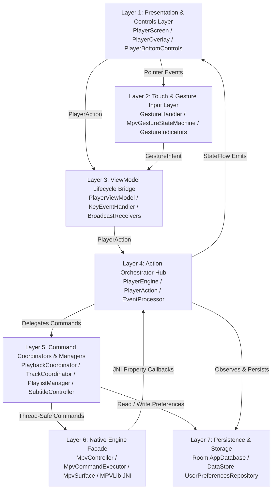
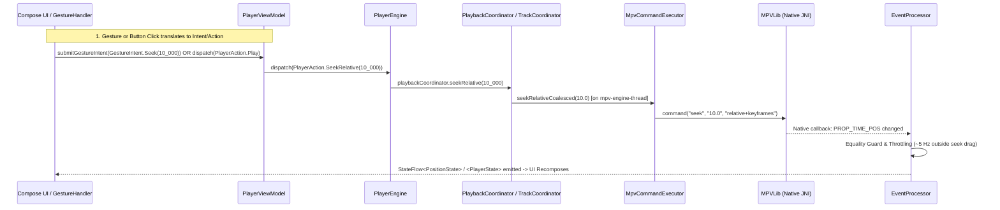

# Potato Player MPV — Complete Codebase Map (`map.md`)

Welcome to the **Potato Player MPV** Codebase Map. This document provides a definitive structural directory tree, comprehensive module map, exact file reference table, architectural dependency diagrams, user interaction flowcharts, gesture state machine matrices, and native `libmpv` property/command registries for the entire repository following the Phase 1 Structural Refactor.

---

## 1. Directory Tree & Package Structure

```
c:\Users\tapman\Desktop\potatompv - 22\mpvplayer22\
├── app/src/main/java/com/tapman104/mpvplayer/
│   ├── MainActivity.kt                     # Application launcher & entry point (hosts HomeScreen)
│   ├── PlayerActivity.kt                   # Pure full-screen window host (window flags, PiP, pickers, lifecycle delegation)
│   ├── core/
│   │   ├── database/                       # Room SQLite persistence layer
│   │   │   ├── AppDatabase.kt              # Room Database configuration & DAO provider
│   │   │   ├── ResumePositionDao.kt        # Data Access Object for watch progress CRUD queries
│   │   │   └── ResumePositionEntity.kt     # SQLite entity storing file path, position & duration
│   │   ├── engine/                         # Native C/JNI libmpv engine abstraction & surface management
│   │   │   ├── EventProcessor.kt           # Throttled time-pos (~5 Hz), seek suppression & state sync
│   │   │   ├── MpvCommandExecutor.kt       # Single-thread command queue, debounced seeking & surface detachment
│   │   │   ├── MpvConstants.kt             # Static libmpv property & command string literals
│   │   │   ├── MpvController.kt            # Native engine lifecycle & GPU surface facade
│   │   │   ├── MpvEventDispatcher.kt       # JNI event router & MpvEventListener contract
│   │   │   ├── MpvOptionsConfigurator.kt   # Pre-init VO/GPU context & bundled font asset (`Roboto-Regular.ttf`) configurator
│   │   │   ├── MpvSurface.kt               # Generation-aware Android Surface binding wrapper
│   │   │   └── TrackListParser.kt          # JSON/property parser for audio & subtitle tracks
│   │   └── preferences/                    # Android DataStore preference storage
│   │       └── UserPreferencesRepository.kt # Persistent hardware decode, gesture, styling & playback store
│   ├── home/ui/
│   │   └── HomeScreen.kt                   # Home screen media launcher UI & file/stream selector
│   ├── player/
│   │   ├── controls/                       # On-screen player control bars & design tokens
│   │   │   ├── PlayerBottomControls.kt     # Bottom bar with interactive seekbar, drag preview & play/pause
│   │   │   ├── PlayerControlsStyles.kt     # Shared glassmorphic design tokens & styled icon buttons
│   │   │   ├── PlayerQuickActions.kt       # Quick action bar (aspect ratio, hwdec chip, more options overflow)
│   │   │   ├── PlayerTopBar.kt             # Header bar with back navigation, file title & track pickers
│   │   │   └── PlayerViewControls.kt       # Row of buttons for cycling ViewMode, rotation & PiP
│   │   ├── dialog/                         # Styling & hardware decode modals
│   │   │   ├── DecodeModePicker.kt         # HW / HW+ / SW decode selector modal card
│   │   │   └── SubtitleAppearanceDialog.kt # Subtitle scale & position slider modal
│   │   ├── dialogs/                        # Track selector & side sheet modals
│   │   │   ├── AudioTrackDialog.kt         # Audio stream picker & audio disable modal
│   │   │   ├── MoreOptionsSheet.kt         # Side sheet for speed chips, FileInfo inspection & settings navigation
│   │   │   └── SubtitleTrackDialog.kt      # Subtitle track selector & external file sideload modal
│   │   ├── engine/                         # Top-level playback action dispatcher & engine hub
│   │   │   ├── PlayerAction.kt             # Sealed interface of all UI commands dispatched to PlayerEngine
│   │   │   └── PlayerEngine.kt             # Master engine orchestrator wiring coordinators, managers & preferences
│   │   ├── gesture/                        # Multi-touch gesture classification & visual overlay hub
│   │   │   ├── GestureHandler.kt           # Compose touch interceptor emitting GestureIntent & overlay host
│   │   │   ├── GestureIndicators.kt        # Volume, brightness, seek, speed & zoom visual overlays
│   │   │   ├── GestureIntent.kt            # Sealed class representing all gesture-produced intents
│   │   │   ├── GestureModels.kt            # MpvPlayerController contract & mutually exclusive state definitions
│   │   │   └── MpvGestureStateMachine.kt   # Single-ownership touch sequence classifier
│   │   ├── input/                          # Hardware key event interceptors
│   │   │   └── KeyEventHandler.kt          # Routes volume hardware keys (`onKeyDown`/`onKeyUp`) to volume-sync callbacks
│   │   ├── model/                          # Domain models & enums
│   │   │   ├── AspectRatioMode.kt          # Aspect ratio enum (`DEFAULT`, `FIT`, `CROP`, `STRETCH`)
│   │   │   ├── AudioTrack.kt               # Audio track domain model (`id`, `name`, `lang`, `isSelected`)
│   │   │   ├── DecodeMode.kt               # Hardware decoding enum (`HW`, `HWPlus`, `SW`)
│   │   │   ├── FileInfo.kt                 # Media metadata model (`fileName`, `filePath`, `durationMs`, track counts)
│   │   │   ├── QuickActionsPosition.kt     # Enum for positioning quick-actions (`TOP_LEFT`, `TOP_RIGHT`, `BOTTOM_LEFT`)
│   │   │   ├── SubtitleTrack.kt            # Subtitle track domain model (`id`, `name`, `lang`, `isExternal`, `isSelected`)
│   │   │   └── ViewMode.kt                 # Video scaling & pan-scan enum (`FIT`, `FILL`, `STRETCH`)
│   │   ├── playback/                       # Compose playback viewport & overlay root
│   │   │   ├── PlayerOverlay.kt            # Master overlay stack, dialog host & auto-hide timer coordinator
│   │   │   ├── PlayerScreen.kt             # Root screen layout (`PlayerVideo` + `GestureHandler` + `PlayerOverlay`)
│   │   │   └── PlayerVideo.kt              # AndroidView wrapper embedding `SurfaceView` into Compose
│   │   ├── state/                          # Immutable UI StateFlow models
│   │   │   ├── PlayerState.kt              # Central playback state model (`isPlaying`, `isPaused`, `speed`, `volume`, etc.)
│   │   │   ├── PlaylistState.kt            # Playlist queue & current URI state model
│   │   │   ├── PositionState.kt            # High-frequency timestamp & duration state model
│   │   │   └── SubtitleAppearanceState.kt  # Subtitle styling state (`subScale`, `subPos`, colors, borders)
│   │   └── viewmodel/                      # Business logic, state orchestration & coordinators
│   │       ├── PlaybackCoordinator.kt      # Owns play, pause, seek, volume, speed, aspect & zoom commands
│   │       ├── PlayerViewModel.kt          # Thin lifecycle bridge between Android lifecycle and `PlayerEngine`
│   │       ├── PlayerViewModelFactory.kt   # Dependency injection factory instantiating `PlayerViewModel` & `PlayerEngine`
│   │       ├── PlaylistManager.kt          # Playlist queue, index tracking & EOF auto-advance manager
│   │       ├── ResumePositionManager.kt    # Debounced watch progress auto-saver & restorer
│   │       ├── SubtitleController.kt       # Subtitle selection, sideloading & appearance coordinator
│   │       └── TrackCoordinator.kt         # Owns audio selection, subtitle selection/sideloading & decode switching
│   ├── settings/                           # Application Settings hub
│   │   ├── SettingsScreen.kt               # Root settings Compose screen & cards
│   │   └── SettingsViewModel.kt            # Settings ViewModel managing `UserPreferencesRepository`
│   ├── ui/theme/                           # Material Design 3 Design System
│   │   ├── Color.kt                        # App color palette definitions
│   │   ├── Theme.kt                        # `MpvPlayerTheme` wrapper
│   │   └── Type.kt                         # Typography scale definitions
│   └── util/                               # Core utility helpers
│       ├── TimeFormatter.kt                # `HH:MM:SS` and `MM:SS` timestamp formatter
│       └── UriResolver.kt                  # Content URI to file descriptor/real path resolver
├── app/src/test/java/com/tapman104/mpvplayer/
│   ├── core/engine/
│   │   └── EventProcessorTest.kt           # Throttled time-pos (~5 Hz), seek suppression & state sync test suite
│   └── player/
│       ├── gesture/
│       │   ├── GestureStateCoverageTest.kt     # 100% mutually exclusive gesture state transition verification
│       │   └── MpvGestureStateMachineTest.kt   # Multi-touch gesture classifier test suite
│       └── model/
│           └── DecodeModeTest.kt               # Hardware decode mapping verification
├── flow.md                                 # Comprehensive codebase architecture & execution flow report
└── map.md                                  # Complete codebase map (this document)
```

---

## 2. Complete File Reference Table

| Package Area | File & Clickable Link | Core Purpose | Key Methods / Properties | Key Collaborators |
| :--- | :--- | :--- | :--- | :--- |
| **App Entry** | [MainActivity.kt](file:///c:/Users/tapman/Desktop/potatompv%20-%2022/mpvplayer22/app/src/main/java/com/tapman104/mpvplayer/MainActivity.kt) | Application launcher & navigation host | `onCreate()`, `HomeScreen` wiring | `HomeScreen`, `PlayerActivity` |
| **App Entry** | [PlayerActivity.kt](file:///c:/Users/tapman/Desktop/potatompv%20-%2022/mpvplayer22/app/src/main/java/com/tapman104/mpvplayer/PlayerActivity.kt) | Pure window host managing `SurfaceView`, window flags, PiP, file pickers, and delegating key/lifecycle events | `onCreate()`, `onUserLeaveHint()`, `keyEventHandler`, `filePickerLauncher` | `PlayerViewModel`, `PlayerScreen`, `KeyEventHandler` |
| **Core Database** | [AppDatabase.kt](file:///c:/Users/tapman/Desktop/potatompv%20-%2022/mpvplayer22/app/src/main/java/com/tapman104/mpvplayer/core/database/AppDatabase.kt) | Room SQLite database initialization & DAO provider | `resumePositionDao()` | `ResumePositionDao`, `ResumePositionEntity` |
| **Core Database** | [ResumePositionDao.kt](file:///c:/Users/tapman/Desktop/potatompv%20-%2022/mpvplayer22/app/src/main/java/com/tapman104/mpvplayer/core/database/ResumePositionDao.kt) | Room DAO for playback progress queries | `savePosition()`, `getPosition()`, `deletePosition()` | `ResumePositionEntity` |
| **Core Database** | [ResumePositionEntity.kt](file:///c:/Users/tapman/Desktop/potatompv%20-%2022/mpvplayer22/app/src/main/java/com/tapman104/mpvplayer/core/database/ResumePositionEntity.kt) | SQLite entity storing file path, timestamp & duration | `filePath`, `positionMs`, `durationMs` | `ResumePositionDao` |
| **Core Engine** | [EventProcessor.kt](file:///c:/Users/tapman/Desktop/potatompv%20-%2022/mpvplayer22/app/src/main/java/com/tapman104/mpvplayer/core/engine/EventProcessor.kt) | Throttles high-frequency `time-pos` updates (~5 Hz outside seek drag), suppresses seek echo, and synchronizes state | `onFileLoaded()`, `onPlaybackStarted()`, `onPlaybackStopped()`, `onPropertyChange()` | `MpvEventDispatcher`, `PlayerEngine`, `PlayerState` |
| **Core Engine** | [MpvCommandExecutor.kt](file:///c:/Users/tapman/Desktop/potatompv/mpvplayer/app/src/main/java/com/tapman104/mpvplayer/core/engine/MpvCommandExecutor.kt) | Single-thread safe command queue (`mpv-engine-thread`), coalesced seek debouncer, and generation-aware surface detachment | `execute()`, `seekGesture()`, `seekCommit()`, `nextSurfaceGeneration()`, `detachSurface()` | `MPVLib` (JNI), `MpvSurface`, `PlaybackCoordinator` |
| **Core Engine** | [MpvConstants.kt](file:///c:/Users/tapman/Desktop/potatompv/mpvplayer/app/src/main/java/com/tapman104/mpvplayer/core/engine/MpvConstants.kt) | Static libmpv property & command string literals | `PROP_PAUSE`, `PROP_TIME_POS`, `PROP_HWDEC`, `PROP_SPEED`, etc. | Global Engine, `EventProcessor`, Coordinators |
| **Core Engine** | [MpvController.kt](file:///c:/Users/tapman/Desktop/potatompv/mpvplayer/app/src/main/java/com/tapman104/mpvplayer/core/engine/MpvController.kt) | Native libmpv engine facade & lifecycle governor | `init()`, `destroy()`, `copyFontAsset()` | `MpvCommandExecutor`, `MpvEventDispatcher`, `MpvOptionsConfigurator`, `MpvSurface` |
| **Core Engine** | [MpvEventDispatcher.kt](file:///c:/Users/tapman/Desktop/potatompv/mpvplayer/app/src/main/java/com/tapman104/mpvplayer/core/engine/MpvEventDispatcher.kt) | JNI callback router broadcasting native property events to registered listeners | `eventProperty()`, `addListener()`, `removeListener()` | `MpvEventListener`, `EventProcessor` |
| **Core Engine** | [MpvOptionsConfigurator.kt](file:///c:/Users/tapman/Desktop/potatompv/mpvplayer/app/src/main/java/com/tapman104/mpvplayer/core/engine/MpvOptionsConfigurator.kt) | Pre-init VO/GPU context & bundled font asset (`Roboto-Regular.ttf`) configurator | `initOptions()`, `copyFontAssets()` | `MPVLib`, Android Assets (`Context.assets`) |
| **Core Engine** | [MpvSurface.kt](file:///c:/Users/tapman/Desktop/potatompv/mpvplayer/app/src/main/java/com/tapman104/mpvplayer/core/engine/MpvSurface.kt) | Generation-aware Android surface binding manager | `surfaceCreated()`, `surfaceDestroyed()`, `setVo()`, `hasSurface()` | `MpvCommandExecutor`, `PlayerActivity`, `PlayerVideo` |
| **Core Engine** | [TrackListParser.kt](file:///c:/Users/tapman/Desktop/potatompv%20-%2022/mpvplayer22/app/src/main/java/com/tapman104/mpvplayer/core/engine/TrackListParser.kt) | Parses native track-list JSON/strings into Kotlin models | `parseTrackList()` | `AudioTrack`, `SubtitleTrack`, `EventProcessor` |
| **Core Preferences** | [UserPreferencesRepository.kt](file:///c:/Users/tapman/Desktop/potatompv%20-%2022/mpvplayer22/app/src/main/java/com/tapman104/mpvplayer/core/preferences/UserPreferencesRepository.kt) | DataStore repository for hardware decode mode, gesture settings, styling & background play | `setDecodeMode()`, `updateSubtitleSize()`, `resumePlayback`, `backgroundPlay` flows | `PlayerEngine`, `TrackCoordinator`, `SettingsViewModel` |
| **Home UI** | [HomeScreen.kt](file:///c:/Users/tapman/Desktop/potatompv%20-%2022/mpvplayer22/app/src/main/java/com/tapman104/mpvplayer/home/ui/HomeScreen.kt) | Home screen media launcher UI allowing local file selection or network streaming | `HomeScreen(...)` | `MainActivity`, `PlayerActivity` |
| **Player Controls** | [PlayerBottomControls.kt](file:///c:/Users/tapman/Desktop/potatompv%20-%2022/mpvplayer22/app/src/main/java/com/tapman104/mpvplayer/player/controls/PlayerBottomControls.kt) | Bottom playback bar with interactive seekbar slider, drag preview & play/pause button | `PlayerBottomControls(...)`, `onSeekPreviewMs`, `onSeekGesture`, `onSeekCommitMs` | `PlayerOverlay`, `TimeFormatter`, `PlayerControlsStyles` |
| **Player Controls** | [PlayerControlsStyles.kt](file:///c:/Users/tapman/Desktop/potatompv%20-%2022/mpvplayer22/app/src/main/java/com/tapman104/mpvplayer/player/controls/PlayerControlsStyles.kt) | Shared glassmorphic design tokens, dimensions & styled icon buttons | `PlayerIconButton(...)`, `Modifier.controlBarBackground(...)` | All control bars (`PlayerTopBar`, `PlayerBottomControls`, etc.) |
| **Player Controls** | [PlayerQuickActions.kt](file:///c:/Users/tapman/Desktop/potatompv%20-%2022/mpvplayer22/app/src/main/java/com/tapman104/mpvplayer/player/controls/PlayerQuickActions.kt) | Quick action bar (aspect ratio toggle, hwdec selector chip, 3-dot overflow button) | `PlayerQuickActions(...)` | `PlayerOverlay`, `PlayerControlsStyles` |
| **Player Controls** | [PlayerTopBar.kt](file:///c:/Users/tapman/Desktop/potatompv%20-%2022/mpvplayer22/app/src/main/java/com/tapman104/mpvplayer/player/controls/PlayerTopBar.kt) | Header bar with back arrow, file title, and audio/subtitle selectors | `PlayerTopBar(...)` | `PlayerOverlay`, `PlayerActivity`, `PlayerControlsStyles` |
| **Player Controls** | [PlayerViewControls.kt](file:///c:/Users/tapman/Desktop/potatompv%20-%2022/mpvplayer22/app/src/main/java/com/tapman104/mpvplayer/player/controls/PlayerViewControls.kt) | Row of buttons for cycling `ViewMode`, video rotation (90° toggle) & PiP | `PlayerViewControls(...)` | `PlayerOverlay`, `ViewMode` |
| **Player Dialogs** | [DecodeModePicker.kt](file:///c:/Users/tapman/Desktop/potatompv%20-%2022/mpvplayer22/app/src/main/java/com/tapman104/mpvplayer/player/dialog/DecodeModePicker.kt) | Hardware decode selector modal card (`HW` / `HW+` / `SW`) | `DecodeModePicker(...)` | `PlayerOverlay`, `DecodeMode`, `TrackCoordinator` |
| **Player Dialogs** | [SubtitleAppearanceDialog.kt](file:///c:/Users/tapman/Desktop/potatompv%20-%2022/mpvplayer22/app/src/main/java/com/tapman104/mpvplayer/player/dialog/SubtitleAppearanceDialog.kt) | Subtitle font scale (`sub-scale`) and screen position (`sub-pos`) slider modal | `SubtitleAppearanceDialog(...)` | `PlayerOverlay`, `SubtitleController` |
| **Player Dialogs** | [AudioTrackDialog.kt](file:///c:/Users/tapman/Desktop/potatompv%20-%2022/mpvplayer22/app/src/main/java/com/tapman104/mpvplayer/player/dialogs/AudioTrackDialog.kt) | Modal dialog for switching audio streams or disabling audio | `AudioTrackDialog(...)` | `PlayerOverlay`, `TrackCoordinator` |
| **Player Dialogs** | [MoreOptionsSheet.kt](file:///c:/Users/tapman/Desktop/potatompv%20-%2022/mpvplayer22/app/src/main/java/com/tapman104/mpvplayer/player/dialogs/MoreOptionsSheet.kt) | Side sheet for speed chips (`0.5x..2.0x`), `FileInfo` inspection & settings navigation | `MoreOptionsSheet(...)` | `PlayerOverlay`, `FileInfo`, `PlayerActivity` |
| **Player Dialogs** | [SubtitleTrackDialog.kt](file:///c:/Users/tapman/Desktop/potatompv%20-%2022/mpvplayer22/app/src/main/java/com/tapman104/mpvplayer/player/dialogs/SubtitleTrackDialog.kt) | Modal dialog for embedded subtitle selection & external file sideloading | `SubtitleTrackDialog(...)` | `PlayerOverlay`, `TrackCoordinator` |
| **Player Engine** | [PlayerAction.kt](file:///c:/Users/tapman/Desktop/potatompv%20-%2022/mpvplayer22/app/src/main/java/com/tapman104/mpvplayer/player/engine/PlayerAction.kt) | Sealed interface representing all UI actions dispatched to `PlayerEngine` | `Play`, `Pause`, `SeekRelative`, `SetVolume`, `SetSpeed`, `SetDecodeMode`, `LoadAndPlay`, etc. | `PlayerEngine`, `PlayerViewModel`, `PlayerActivity` |
| **Player Engine** | [PlayerEngine.kt](file:///c:/Users/tapman/Desktop/potatompv%20-%2022/mpvplayer22/app/src/main/java/com/tapman104/mpvplayer/player/engine/PlayerEngine.kt) | Top-level orchestrator wiring coordinators, sub-managers & preferences; exposes `dispatch` | `dispatch(action)`, `state`, `init()`, `destroy()` | `PlaybackCoordinator`, `TrackCoordinator`, `PlaylistManager`, `SubtitleController`, `ResumePositionManager`, `MpvController` |
| **Player Gesture** | [GestureHandler.kt](file:///c:/Users/tapman/Desktop/potatompv%20-%2022/mpvplayer22/app/src/main/java/com/tapman104/mpvplayer/player/gesture/GestureHandler.kt) | Compose touch interceptor implementing `MpvPlayerController`; classifies touch via state machine and emits `GestureIntent` | `GestureHandler(...)`, `onIntent(GestureIntent)` | `MpvGestureStateMachine`, `GestureIntent`, `GestureIndicators`, `PlayerOverlay` |
| **Player Gesture** | [GestureIndicators.kt](file:///c:/Users/tapman/Desktop/potatompv%20-%2022/mpvplayer22/app/src/main/java/com/tapman104/mpvplayer/player/gesture/GestureIndicators.kt) | Consolidated visual feedback overlays (`VolumeIndicator`, `BrightnessIndicator`, `SeekCircleIndicator`, `SpeedIndicator`, `PinchZoomIndicator`) | `VolumeIndicator(...)`, `BrightnessIndicator(...)`, `HorizontalSeekIndicator(...)`, `IndicatorPill(...)` | `GestureHandler`, Compose UI |
| **Player Gesture** | [GestureIntent.kt](file:///c:/Users/tapman/Desktop/potatompv%20-%2022/mpvplayer22/app/src/main/java/com/tapman104/mpvplayer/player/gesture/GestureIntent.kt) | Sealed class hierarchy of player-affecting intents produced by gestures (`Seek`, `TogglePlay`, `SetSpeed`, `VolumeChange`, `BrightnessChange`, `ZoomChange`) | Data variants (`Seek`, `SeekCommit`, `SetSpeed`, etc.) | Emitted by `GestureHandler`, collected by `PlayerViewModel` |
| **Player Gesture** | [GestureModels.kt](file:///c:/Users/tapman/Desktop/potatompv%20-%2022/mpvplayer22/app/src/main/java/com/tapman104/mpvplayer/player/gesture/GestureModels.kt) | Defines `MpvPlayerController` interface, `TapRegion`, and mutually exclusive `GestureState` sealed classes | `MpvPlayerController`, `GestureState` hierarchy | `MpvGestureStateMachine`, `GestureHandler` |
| **Player Gesture** | [MpvGestureStateMachine.kt](file:///c:/Users/tapman/Desktop/potatompv%20-%2022/mpvplayer22/app/src/main/java/com/tapman104/mpvplayer/player/gesture/MpvGestureStateMachine.kt) | Single-ownership touch sequence state machine classifying pointers without ambiguity | `onPointerDown()`, `onPointerMove()`, `onPointerUp()`, `transitionTo()` | `GestureModels`, `GestureHandler` |
| **Player Input** | [KeyEventHandler.kt](file:///c:/Users/tapman/Desktop/potatompv%20-%2022/mpvplayer22/app/src/main/java/com/tapman104/mpvplayer/player/input/KeyEventHandler.kt) | Intercepts hardware volume keys (`onKeyDown`/`onKeyUp`), syncs system volume and invokes `onVolumeSync(pct)` | `handleKeyDown()`, `handleKeyUp()`, `syncSystemVolume()` | `PlayerActivity`, `PlayerViewModel` |
| **Player Models** | [AspectRatioMode.kt](file:///c:/Users/tapman/Desktop/potatompv%20-%2022/mpvplayer22/app/src/main/java/com/tapman104/mpvplayer/player/model/AspectRatioMode.kt) | Aspect ratio enum (`DEFAULT`, `FIT`, `CROP`, `STRETCH`) | Enum entries | `PlaybackCoordinator`, `PlayerQuickActions` |
| **Player Models** | [AudioTrack.kt](file:///c:/Users/tapman/Desktop/potatompv%20-%2022/mpvplayer22/app/src/main/java/com/tapman104/mpvplayer/player/model/AudioTrack.kt) & [SubtitleTrack.kt](file:///c:/Users/tapman/Desktop/potatompv%20-%2022/mpvplayer22/app/src/main/java/com/tapman104/mpvplayer/player/model/SubtitleTrack.kt) | Track metadata models | `id`, `name`, `lang`, `isSelected`, `isExternal` | `TrackListParser`, `TrackCoordinator` |
| **Player Models** | [DecodeMode.kt](file:///c:/Users/tapman/Desktop/potatompv%20-%2022/mpvplayer22/app/src/main/java/com/tapman104/mpvplayer/player/model/DecodeMode.kt) | Hardware decoding mode enum (`HW`, `HWPlus`, `SW`) | `mpvValue`, enum entries | `TrackCoordinator`, `DecodeModePicker` |
| **Player Models** | [FileInfo.kt](file:///c:/Users/tapman/Desktop/potatompv%20-%2022/mpvplayer22/app/src/main/java/com/tapman104/mpvplayer/player/model/FileInfo.kt) | Media metadata model | `fileName`, `filePath`, `durationMs`, track counts | `MoreOptionsSheet`, `PlayerState` |
| **Player Models** | [QuickActionsPosition.kt](file:///c:/Users/tapman/Desktop/potatompv%20-%2022/mpvplayer22/app/src/main/java/com/tapman104/mpvplayer/player/model/QuickActionsPosition.kt) | Overlay positioning enum for quick actions (`TOP_LEFT`, `TOP_RIGHT`, `BOTTOM_LEFT`) | Enum entries | `PlayerOverlay`, `PlayerViewModel` |
| **Player Models** | [ViewMode.kt](file:///c:/Users/tapman/Desktop/potatompv%20-%2022/mpvplayer22/app/src/main/java/com/tapman104/mpvplayer/player/model/ViewMode.kt) | Video scaling & pan-scan enum (`FIT`, `FILL`, `STRETCH`) | `mpvPanScan`, `mpvAspect` | `PlayerViewModel`, `PlayerViewControls` |
| **Player Playback** | [PlayerOverlay.kt](file:///c:/Users/tapman/Desktop/potatompv%20-%2022/mpvplayer22/app/src/main/java/com/tapman104/mpvplayer/player/playback/PlayerOverlay.kt) | Master overlay stack holding control bars, dialogs, gestures & auto-hide timer (`3s`) | `PlayerOverlay(...)` | `PlayerScreen`, `PlayerTopBar`, `PlayerBottomControls`, `PlayerQuickActions`, `MoreOptionsSheet` |
| **Player Playback** | [PlayerScreen.kt](file:///c:/Users/tapman/Desktop/potatompv%20-%2022/mpvplayer22/app/src/main/java/com/tapman104/mpvplayer/player/playback/PlayerScreen.kt) | Root Compose playback screen combining video output, gestures & controls | `PlayerScreen(...)` | `PlayerActivity`, `PlayerVideo`, `GestureHandler`, `PlayerOverlay` |
| **Player Playback** | [PlayerVideo.kt](file:///c:/Users/tapman/Desktop/potatompv%20-%2022/mpvplayer22/app/src/main/java/com/tapman104/mpvplayer/player/playback/PlayerVideo.kt) | AndroidView wrapper embedding `SurfaceView` into Compose and binding `MpvSurface` | `PlayerVideo(...)` | `PlayerScreen`, `MpvSurface` |
| **Player State** | [PlayerState.kt](file:///c:/Users/tapman/Desktop/potatompv%20-%2022/mpvplayer22/app/src/main/java/com/tapman104/mpvplayer/player/state/PlayerState.kt) | Central immutable playback UI state model | `isPlaying`, `isPaused`, `speed`, `volume`, `durationMs`, track lists | `PlayerEngine`, `EventProcessor`, UI screens |
| **Player State** | [PlaylistState.kt](file:///c:/Users/tapman/Desktop/potatompv%20-%2022/mpvplayer22/app/src/main/java/com/tapman104/mpvplayer/player/state/PlaylistState.kt) | Playlist queue & active index state model | `items`, `currentIndex`, `currentUri` | `PlaylistManager`, `PlayerEngine` |
| **Player State** | [PositionState.kt](file:///c:/Users/tapman/Desktop/potatompv%20-%2022/mpvplayer22/app/src/main/java/com/tapman104/mpvplayer/player/state/PositionState.kt) | High-frequency timestamp & duration UI state model | `currentPositionMs`, `durationMs`, `bufferProgress` | `EventProcessor`, `PlayerEngine`, seekbars |
| **Player State** | [SubtitleAppearanceState.kt](file:///c:/Users/tapman/Desktop/potatompv%20-%2022/mpvplayer22/app/src/main/java/com/tapman104/mpvplayer/player/state/SubtitleAppearanceState.kt) | Subtitle styling state (`subScale`, `subPos`, colors, borders, shadows) | Data properties | `SubtitleController`, `SubtitleAppearanceDialog` |
| **Player ViewModel** | [PlaybackCoordinator.kt](file:///c:/Users/tapman/Desktop/potatompv%20-%2022/mpvplayer22/app/src/main/java/com/tapman104/mpvplayer/player/viewmodel/PlaybackCoordinator.kt) | Owns play, pause, seek, volume, speed, aspect ratio & zoom/pan commands; mutates `sharedPlayerState` | `play()`, `pause()`, `seekRelative()`, `setVolume()`, `setSpeed()`, `setAspectRatio()` | `PlayerEngine`, `MpvController`, `EventProcessor` |
| **Player ViewModel** | [PlayerViewModel.kt](file:///c:/Users/tapman/Desktop/potatompv%20-%2022/mpvplayer22/app/src/main/java/com/tapman104/mpvplayer/player/viewmodel/PlayerViewModel.kt) | Thin lifecycle bridge observing Android lifecycle, collecting `GestureIntent`, and delegating to `PlayerEngine` | `dispatch(action)`, `submitGestureIntent()`, `onScreenOff()`, `onLifecycleEvent()` | `PlayerActivity`, `PlayerEngine`, `GestureIntent` |
| **Player ViewModel** | [PlayerViewModelFactory.kt](file:///c:/Users/tapman/Desktop/potatompv%20-%2022/mpvplayer22/app/src/main/java/com/tapman104/mpvplayer/player/viewmodel/PlayerViewModelFactory.kt) | Dependency injection factory instantiating `PlayerEngine`, `EventProcessor`, coordinators & `PlayerViewModel` | `create()` | `PlayerActivity`, `AppDatabase`, `UserPreferencesRepository` |
| **Player ViewModel** | [PlaylistManager.kt](file:///c:/Users/tapman/Desktop/potatompv%20-%2022/mpvplayer22/app/src/main/java/com/tapman104/mpvplayer/player/viewmodel/PlaylistManager.kt) | Playlist queue, index tracking & EOF auto-advance manager | `loadAndPlay()`, `playNext()`, `playPrevious()`, `onEndOfFile()` | `PlayerEngine`, `PlaylistState` |
| **Player ViewModel** | [ResumePositionManager.kt](file:///c:/Users/tapman/Desktop/potatompv%20-%2022/mpvplayer22/app/src/main/java/com/tapman104/mpvplayer/player/viewmodel/ResumePositionManager.kt) | Debounced watch progress auto-saver & restorer (`ResumePositionDao`) | `saveCurrentPosition()`, `loadResumePosition()`, `clearResumePosition()` | `PlayerEngine`, `ResumePositionDao` |
| **Player ViewModel** | [SubtitleController.kt](file:///c:/Users/tapman/Desktop/potatompv%20-%2022/mpvplayer22/app/src/main/java/com/tapman104/mpvplayer/player/viewmodel/SubtitleController.kt) | Subtitle track selection, sideloading (`sub-add`) & appearance styling coordinator | `setSubtitleSize()`, `setSubtitlePosition()`, `setPreferredSubtitleLanguage()` | `PlayerEngine`, `MpvController`, `UserPreferencesRepository` |
| **Player ViewModel** | [TrackCoordinator.kt](file:///c:/Users/tapman/Desktop/potatompv%20-%2022/mpvplayer22/app/src/main/java/com/tapman104/mpvplayer/player/viewmodel/TrackCoordinator.kt) | Owns audio selection/sideloading, subtitle selection/sideloading & decode switching (`cycleDecodeMode`) | `setAudioTrack()`, `addAudioTrack()`, `setSubtitleTrack()`, `addSubtitle()`, `cycleDecodeMode()` | `PlayerEngine`, `MpvController`, `UserPreferencesRepository` |
| **Settings** | [SettingsScreen.kt](file:///c:/Users/tapman/Desktop/potatompv%20-%2022/mpvplayer22/app/src/main/java/com/tapman104/mpvplayer/settings/SettingsScreen.kt) & [SettingsViewModel.kt](file:///c:/Users/tapman/Desktop/potatompv%20-%2022/mpvplayer22/app/src/main/java/com/tapman104/mpvplayer/settings/SettingsViewModel.kt) | Global application settings UI & DataStore state manager | `SettingsScreen(...)`, `update*()` | `UserPreferencesRepository`, `PlayerActivity` |
| **UI Theme** | [Color.kt](file:///c:/Users/tapman/Desktop/potatompv%20-%2022/mpvplayer22/app/src/main/java/com/tapman104/mpvplayer/ui/theme/Color.kt), [Theme.kt](file:///c:/Users/tapman/Desktop/potatompv%20-%2022/mpvplayer22/app/src/main/java/com/tapman104/mpvplayer/ui/theme/Theme.kt) & [Type.kt](file:///c:/Users/tapman/Desktop/potatompv%20-%2022/mpvplayer22/app/src/main/java/com/tapman104/mpvplayer/ui/theme/Type.kt) | Material Design 3 theme definitions | `MpvPlayerTheme(...)`, color scale, typography | Compose UI components across all screens |
| **Utilities** | [TimeFormatter.kt](file:///c:/Users/tapman/Desktop/potatompv%20-%2022/mpvplayer22/app/src/main/java/com/tapman104/mpvplayer/util/TimeFormatter.kt) & [UriResolver.kt](file:///c:/Users/tapman/Desktop/potatompv%20-%2022/mpvplayer22/app/src/main/java/com/tapman104/mpvplayer/util/UriResolver.kt) | `HH:MM:SS` formatting and content URI to real path / file descriptor resolution | `formatTime()`, `resolveUri()`, `getDisplayName()` | `PlayerBottomControls`, `TrackCoordinator`, `PlayerActivity` |
| **Tests** | [EventProcessorTest.kt](file:///c:/Users/tapman/Desktop/potatompv%20-%2022/mpvplayer22/app/src/test/java/com/tapman104/mpvplayer/core/engine/EventProcessorTest.kt) | Unit test suite verifying `EventProcessor` state updates, pause sync, `time-pos` throttling (~5 Hz) & seek suppression | `@Test verifyEventProcessing` | `EventProcessor` |
| **Tests** | [GestureStateCoverageTest.kt](file:///c:/Users/tapman/Desktop/potatompv%20-%2022/mpvplayer22/app/src/test/java/com/tapman104/mpvplayer/player/gesture/GestureStateCoverageTest.kt) | 100% mutually exclusive state transition coverage test | `@Test verifyStateTransitions` | `GestureState` |
| **Tests** | [MpvGestureStateMachineTest.kt](file:///c:/Users/tapman/Desktop/potatompv%20-%2022/mpvplayer22/app/src/test/java/com/tapman104/mpvplayer/player/gesture/MpvGestureStateMachineTest.kt) | Touch classifier & multi-touch gesture test suite | `@Test verifyMultiTouchAndTap` | `MpvGestureStateMachine` |
| **Tests** | [DecodeModeTest.kt](file:///c:/Users/tapman/Desktop/potatompv%20-%2022/mpvplayer22/app/src/test/java/com/tapman104/mpvplayer/player/model/DecodeModeTest.kt) | Hardware decode enum & libmpv mapping verification | `@Test verifyMpvValues` | `DecodeMode` |

---

## 3. Architecture Layer Dependency & Action/Intent Routing Graph

### 3.1 Layer & Component Dependency Graph



### 3.2 Action & Intent Routing Sequence



---

## 4. User Interaction Flowcharts

### 4.1 Single Tap — Toggle Controls Visibility

```
User taps video viewport once
        │
        ▼
[GestureHandler.kt](file:///c:/Users/tapman/Desktop/potatompv%20-%2022/mpvplayer22/app/src/main/java/com/tapman104/mpvplayer/player/gesture/GestureHandler.kt) (pointerInput interceptor)
        │  finger down → [MpvGestureStateMachine.kt](file:///c:/Users/tapman/Desktop/potatompv%20-%2022/mpvplayer22/app/src/main/java/com/tapman104/mpvplayer/player/gesture/MpvGestureStateMachine.kt): state = TapCandidate
        │  finger up   → no move, no second tap within TAP_TIMEOUT_MS → state = Idle
        ▼
[GestureHandler.kt](file:///c:/Users/tapman/Desktop/potatompv%20-%2022/mpvplayer22/app/src/main/java/com/tapman104/mpvplayer/player/gesture/GestureHandler.kt) (MpvPlayerController.triggerSingleTapAction)
        │  → invokes `onToggleControls()` callback
        ▼
[PlayerOverlay.kt](file:///c:/Users/tapman/Desktop/potatompv%20-%2022/mpvplayer22/app/src/main/java/com/tapman104/mpvplayer/player/playback/PlayerOverlay.kt) (`controlsVisible` toggle)
        │  if hidden  → show controls + restart auto-hide timer (3s)
        │  if visible → hide controls immediately
        ▼
Compose recomposition: TopBar / BottomControls / QuickActions / ViewControls fade in/out
```

---

### 4.2 Double Tap — Seek Jump (Left / Right Edge)

```
User double-taps left edge (<30% width)         User double-taps right edge (>70% width)
        │                                               │
        ▼                                               ▼
[GestureHandler.kt](file:///c:/Users/tapman/Desktop/potatompv%20-%2022/mpvplayer22/app/src/main/java/com/tapman104/mpvplayer/player/gesture/GestureHandler.kt)                             [GestureHandler.kt](file:///c:/Users/tapman/Desktop/potatompv%20-%2022/mpvplayer22/app/src/main/java/com/tapman104/mpvplayer/player/gesture/GestureHandler.kt)
        │  2nd tap within TAP_TIMEOUT_MS               │  same
        │  → state = MultiTapSeeking                    │  state = MultiTapSeeking
        │  side = LEFT                                  │  side = RIGHT
        ▼                                               ▼
Emits [GestureIntent.Seek(-10_000)]                     Emits [GestureIntent.Seek(+10_000)]
        │                                               │
        ▼                                               ▼
[PlayerViewModel.kt](file:///c:/Users/tapman/Desktop/potatompv%20-%2022/mpvplayer22/app/src/main/java/com/tapman104/mpvplayer/player/viewmodel/PlayerViewModel.kt) (`_gestureIntents` collection)
        │  → dispatches [PlayerAction.SeekRelative(±10_000)]
        ▼
[PlayerEngine.kt](file:///c:/Users/tapman/Desktop/potatompv%20-%2022/mpvplayer22/app/src/main/java/com/tapman104/mpvplayer/player/engine/PlayerEngine.kt) → [PlaybackCoordinator.kt](file:///c:/Users/tapman/Desktop/potatompv%20-%2022/mpvplayer22/app/src/main/java/com/tapman104/mpvplayer/player/viewmodel/PlaybackCoordinator.kt).seekRelative(±10_000 ms)
        │
        ▼
[MpvCommandExecutor.kt](file:///c:/Users/tapman/Desktop/potatompv%20-%2022/mpvplayer22/app/src/main/java/com/tapman104/mpvplayer/core/engine/MpvCommandExecutor.kt) → `MPVLib.command("seek", "±10.0", "relative")` [mpv-engine-thread]

Side effect → [GestureIndicators.kt](file:///c:/Users/tapman/Desktop/potatompv%20-%2022/mpvplayer22/app/src/main/java/com/tapman104/mpvplayer/player/gesture/GestureIndicators.kt): left/right `SeekCircleIndicator` ripple + label (`-10s` / `+10s`)
```

---

### 4.3 Long Press — Dynamic Speed Scrub (Hold & Release)

```
User presses and holds finger > LONG_PRESS_TIMEOUT_MS
        │
        ▼
[MpvGestureStateMachine.kt](file:///c:/Users/tapman/Desktop/potatompv%20-%2022/mpvplayer22/app/src/main/java/com/tapman104/mpvplayer/player/gesture/MpvGestureStateMachine.kt) state = LongPress → DynamicSpeedScrub
        │
        ▼
[GestureHandler.kt](file:///c:/Users/tapman/Desktop/potatompv%20-%2022/mpvplayer22/app/src/main/java/com/tapman104/mpvplayer/player/gesture/GestureHandler.kt) emits [GestureIntent.SetSpeed(2.0f)]
        │  → [PlayerViewModel.kt](file:///c:/Users/tapman/Desktop/potatompv%20-%2022/mpvplayer22/app/src/main/java/com/tapman104/mpvplayer/player/viewmodel/PlayerViewModel.kt) routes to [PlayerAction.SetPlaybackSpeedRamped(2.0f)]
        │  → [PlaybackCoordinator.kt](file:///c:/Users/tapman/Desktop/potatompv%20-%2022/mpvplayer22/app/src/main/java/com/tapman104/mpvplayer/player/viewmodel/PlaybackCoordinator.kt).setPlaybackSpeedRamped(2.0f) (saves preOverrideSpeed)
        │  → [MpvCommandExecutor.kt](file:///c:/Users/tapman/Desktop/potatompv%20-%2022/mpvplayer22/app/src/main/java/com/tapman104/mpvplayer/core/engine/MpvCommandExecutor.kt).setSpeed(2.0)
        │  → `MPVLib.setPropertyDouble("speed", 2.0)` [mpv-engine-thread]
        ▼
[GestureIndicators.kt](file:///c:/Users/tapman/Desktop/potatompv%20-%2022/mpvplayer22/app/src/main/java/com/tapman104/mpvplayer/player/gesture/GestureIndicators.kt): `SpeedIndicator` overlay shown (`"2.0×"`)

User lifts finger
        │
        ▼
[GestureHandler.kt](file:///c:/Users/tapman/Desktop/potatompv%20-%2022/mpvplayer22/app/src/main/java/com/tapman104/mpvplayer/player/gesture/GestureHandler.kt) emits [GestureIntent.RestoreSpeed(2.0f)]
        │  → [PlayerViewModel.kt](file:///c:/Users/tapman/Desktop/potatompv%20-%2022/mpvplayer22/app/src/main/java/com/tapman104/mpvplayer/player/viewmodel/PlayerViewModel.kt) routes to [PlayerAction.RestorePlaybackSpeed]
        │  → [PlaybackCoordinator.kt](file:///c:/Users/tapman/Desktop/potatompv%20-%2022/mpvplayer22/app/src/main/java/com/tapman104/mpvplayer/player/viewmodel/PlaybackCoordinator.kt).restorePlaybackSpeed()
        │  → `MPVLib.setPropertyDouble("speed", preOverrideSpeed)`
```

---

### 4.4 Vertical Swipe — Volume (Right Edge) / Brightness (Left Edge)

```
User places finger on edge, vertical delta > threshold (dx < dy)
        │
        ▼
[MpvGestureStateMachine.kt](file:///c:/Users/tapman/Desktop/potatompv%20-%2022/mpvplayer22/app/src/main/java/com/tapman104/mpvplayer/player/gesture/MpvGestureStateMachine.kt) state = VerticalSwipe
        │  right half (>50% width) → VOLUME channel
        │  left half  (<50% width) → BRIGHTNESS channel
        ▼
        ├─[VOLUME]─────────────────────────────────────────────────────────────
        │   [GestureHandler.kt](file:///c:/Users/tapman/Desktop/potatompv%20-%2022/mpvplayer22/app/src/main/java/com/tapman104/mpvplayer/player/gesture/GestureHandler.kt) emits [GestureIntent.VolumeChange(delta)]
        │   → [PlayerViewModel.kt](file:///c:/Users/tapman/Desktop/potatompv%20-%2022/mpvplayer22/app/src/main/java/com/tapman104/mpvplayer/player/viewmodel/PlayerViewModel.kt) routes to [PlayerAction.SetVolume(volume)]
        │   → [PlaybackCoordinator.kt](file:///c:/Users/tapman/Desktop/potatompv%20-%2022/mpvplayer22/app/src/main/java/com/tapman104/mpvplayer/player/viewmodel/PlaybackCoordinator.kt).setVolume(volume)
        │   → synchronizes `AudioManager.STREAM_MUSIC` & sets `MPVLib.setPropertyInt("volume", mpvVol)`
        │   → [GestureIndicators.kt](file:///c:/Users/tapman/Desktop/potatompv%20-%2022/mpvplayer22/app/src/main/java/com/tapman104/mpvplayer/player/gesture/GestureIndicators.kt): `VolumeIndicator` bar
        │
        └─[BRIGHTNESS]──────────────────────────────────────────────────────────
            [GestureHandler.kt](file:///c:/Users/tapman/Desktop/potatompv%20-%2022/mpvplayer22/app/src/main/java/com/tapman104/mpvplayer/player/gesture/GestureHandler.kt) emits [GestureIntent.BrightnessChange(delta)]
            → Updates `localBrightness` in window attributes via `PlayerActivity` `updateWindowBrightness` callback
            → [GestureIndicators.kt](file:///c:/Users/tapman/Desktop/potatompv%20-%2022/mpvplayer22/app/src/main/java/com/tapman104/mpvplayer/player/gesture/GestureIndicators.kt): `BrightnessIndicator` bar
```

---

### 4.5 Horizontal Swipe — Seek Scrub

```
User swipes horizontally across viewport (dx > dy)
        │
        ▼
[MpvGestureStateMachine.kt](file:///c:/Users/tapman/Desktop/potatompv%20-%2022/mpvplayer22/app/src/main/java/com/tapman104/mpvplayer/player/gesture/MpvGestureStateMachine.kt) state = HorizontalSeek
        │
        ▼
[GestureHandler.kt](file:///c:/Users/tapman/Desktop/potatompv%20-%2022/mpvplayer22/app/src/main/java/com/tapman104/mpvplayer/player/gesture/GestureHandler.kt) emits [GestureIntent.SeekGestureDrag(targetPositionMs)]
        │  → [PlayerViewModel.kt](file:///c:/Users/tapman/Desktop/potatompv%20-%2022/mpvplayer22/app/src/main/java/com/tapman104/mpvplayer/player/viewmodel/PlayerViewModel.kt) routes to [PlayerAction.SeekGestureDrag(targetPositionMs)]
        │  → [PlaybackCoordinator.kt](file:///c:/Users/tapman/Desktop/potatompv%20-%2022/mpvplayer22/app/src/main/java/com/tapman104/mpvplayer/player/viewmodel/PlaybackCoordinator.kt).seekGestureDrag(positionMs)
        │  → sets `eventProcessor.isSliderSeeking = true` & executes coalesced keyframe seek
        ▼
`MPVLib.command("seek", targetSeconds, "absolute+keyframes")` [mpv-engine-thread]

User lifts finger
        │
        ▼
[GestureHandler.kt](file:///c:/Users/tapman/Desktop/potatompv%20-%2022/mpvplayer22/app/src/main/java/com/tapman104/mpvplayer/player/gesture/GestureHandler.kt) emits [GestureIntent.SeekCommit(finalPositionMs)]
        │  → [PlayerViewModel.kt](file:///c:/Users/tapman/Desktop/potatompv%20-%2022/mpvplayer22/app/src/main/java/com/tapman104/mpvplayer/player/viewmodel/PlayerViewModel.kt) routes to [PlayerAction.SeekCommit(finalPositionMs)]
        │  → [PlaybackCoordinator.kt](file:///c:/Users/tapman/Desktop/potatompv%20-%2022/mpvplayer22/app/src/main/java/com/tapman104/mpvplayer/player/viewmodel/PlaybackCoordinator.kt).seekCommit(positionMs)
        │  → sets `eventProcessor.isSliderSeeking = false` & `lastSeekTime = 0L`
        ▼
`MPVLib.command("seek", finalSeconds, "absolute+exact")` [mpv-engine-thread]
```

---

### 4.6 Pinch — Zoom & Pan

```
Two fingers placed on screen, spread apart or pan
        │
        ▼
[MpvGestureStateMachine.kt](file:///c:/Users/tapman/Desktop/potatompv%20-%2022/mpvplayer22/app/src/main/java/com/tapman104/mpvplayer/player/gesture/MpvGestureStateMachine.kt) pointerCount = 2, state = PinchZoomPan
        │
        ▼
[GestureHandler.kt](file:///c:/Users/tapman/Desktop/potatompv%20-%2022/mpvplayer22/app/src/main/java/com/tapman104/mpvplayer/player/gesture/GestureHandler.kt) emits [GestureIntent.ZoomChange(zoomLog2, panX, panY)]
        │  → [PlayerViewModel.kt](file:///c:/Users/tapman/Desktop/potatompv%20-%2022/mpvplayer22/app/src/main/java/com/tapman104/mpvplayer/player/viewmodel/PlayerViewModel.kt) routes to [PlayerAction.SetZoomAndPan(zoomLog2, panX, panY)]
        │  → [PlaybackCoordinator.kt](file:///c:/Users/tapman/Desktop/potatompv%20-%2022/mpvplayer22/app/src/main/java/com/tapman104/mpvplayer/player/viewmodel/PlaybackCoordinator.kt).setZoomAndPan(zoomLog2, panX, panY)
        ▼
[MpvCommandExecutor.kt](file:///c:/Users/tapman/Desktop/potatompv%20-%2022/mpvplayer22/app/src/main/java/com/tapman104/mpvplayer/core/engine/MpvCommandExecutor.kt)
        │  → `MPVLib.setPropertyDouble("video-zoom", zoomLog2)`
        │  → `MPVLib.setPropertyDouble("video-pan-x", panX)`
        │  → `MPVLib.setPropertyDouble("video-pan-y", panY)` [mpv-engine-thread]
```

---

### 4.7 Seekbar Drag — Bottom Controls Scrub

```
User drags seekbar thumb in [PlayerBottomControls.kt](file:///c:/Users/tapman/Desktop/potatompv%20-%2022/mpvplayer22/app/src/main/java/com/tapman104/mpvplayer/player/controls/PlayerBottomControls.kt)
        │
        ▼
Slider `onValueChange` callback (`onSeekGesture`)
        │  → [PlayerViewModel.dispatch(PlayerAction.SeekGestureDrag(positionMs))](file:///c:/Users/tapman/Desktop/potatompv%20-%2022/mpvplayer22/app/src/main/java/com/tapman104/mpvplayer/player/viewmodel/PlayerViewModel.kt)
        │  → [PlaybackCoordinator.seekGestureDrag(positionMs)](file:///c:/Users/tapman/Desktop/potatompv%20-%2022/mpvplayer22/app/src/main/java/com/tapman104/mpvplayer/player/viewmodel/PlaybackCoordinator.kt) [absolute+keyframes]
        ▼
Slider `onValueChangeFinished` callback (`onSeekCommitMs`)
        │  → [PlayerViewModel.dispatch(PlayerAction.SeekCommit(positionMs))](file:///c:/Users/tapman/Desktop/potatompv%20-%2022/mpvplayer22/app/src/main/java/com/tapman104/mpvplayer/player/viewmodel/PlayerViewModel.kt)
        │  → [PlaybackCoordinator.seekCommit(positionMs)](file:///c:/Users/tapman/Desktop/potatompv%20-%2022/mpvplayer22/app/src/main/java/com/tapman104/mpvplayer/player/viewmodel/PlaybackCoordinator.kt) [absolute+exact]
```

---

### 4.8 Play / Pause Button

```
User taps Play/Pause icon in [PlayerBottomControls.kt](file:///c:/Users/tapman/Desktop/potatompv%20-%2022/mpvplayer22/app/src/main/java/com/tapman104/mpvplayer/player/controls/PlayerBottomControls.kt)
        │
        ▼
`onTogglePlay()` → [PlayerViewModel.dispatch(PlayerAction.TogglePlay)](file:///c:/Users/tapman/Desktop/potatompv%20-%2022/mpvplayer22/app/src/main/java/com/tapman104/mpvplayer/player/viewmodel/PlayerViewModel.kt)
        │  → [PlaybackCoordinator.togglePlay()](file:///c:/Users/tapman/Desktop/potatompv%20-%2022/mpvplayer22/app/src/main/java/com/tapman104/mpvplayer/player/viewmodel/PlaybackCoordinator.kt)
        ▼
[MpvCommandExecutor.kt](file:///c:/Users/tapman/Desktop/potatompv%20-%2022/mpvplayer22/app/src/main/java/com/tapman104/mpvplayer/core/engine/MpvCommandExecutor.kt).togglePlay()
        │  reads current `PROP_PAUSE` and sets `MPVLib.setPropertyBoolean("pause", !paused)`
        ▼
Native JNI event fires → [MpvEventDispatcher.kt](file:///c:/Users/tapman/Desktop/potatompv%20-%2022/mpvplayer22/app/src/main/java/com/tapman104/mpvplayer/core/engine/MpvEventDispatcher.kt) → `onPropertyChange("pause", newValue)`
        │  → [EventProcessor.kt](file:///c:/Users/tapman/Desktop/potatompv%20-%2022/mpvplayer22/app/src/main/java/com/tapman104/mpvplayer/core/engine/EventProcessor.kt) checks equality guard: if (`_playerState.value.isPaused != newValue`) update StateFlow
```

---

### 4.9 ViewMode / Aspect Ratio / Rotate Cycle

```
User taps [AspectRatio] / [Rotate] button in [PlayerViewControls.kt](file:///c:/Users/tapman/Desktop/potatompv%20-%2022/mpvplayer22/app/src/main/java/com/tapman104/mpvplayer/player/controls/PlayerViewControls.kt)
        │
        ├─► Cycle ViewMode (`onCycleViewMode`) → [PlayerViewModel.cycleViewMode()](file:///c:/Users/tapman/Desktop/potatompv%20-%2022/mpvplayer22/app/src/main/java/com/tapman104/mpvplayer/player/viewmodel/PlayerViewModel.kt)
        │     → cycles: FIT → FILL → STRETCH → FIT
        │     → sets `video-pan-scan`, `panscan`, and `video-aspect-override` (`no`, `-1`, etc.)
        │
        └─► Toggle Rotate (`onRotate`) → [PlayerViewModel.toggleVideoRotate()](file:///c:/Users/tapman/Desktop/potatompv%20-%2022/mpvplayer22/app/src/main/java/com/tapman104/mpvplayer/player/viewmodel/PlayerViewModel.kt)
              → cycles rotation: 0° → 90° → 0°
              → sets `MPVLib.setPropertyString("video-rotate", currentRotation.toString())`
```

---

### 4.10 Hardware Decode Mode — Quick Toggle Chip

```
User taps decode chip in [PlayerQuickActions.kt](file:///c:/Users/tapman/Desktop/potatompv%20-%2022/mpvplayer22/app/src/main/java/com/tapman104/mpvplayer/player/controls/PlayerQuickActions.kt) → opens [DecodeModePicker.kt](file:///c:/Users/tapman/Desktop/potatompv%20-%2022/mpvplayer22/app/src/main/java/com/tapman104/mpvplayer/player/dialog/DecodeModePicker.kt)
        │
        ▼
User selects card (HW / HW+ / SW) → [PlayerViewModel.dispatch(PlayerAction.SetDecodeMode(mode))](file:///c:/Users/tapman/Desktop/potatompv%20-%2022/mpvplayer22/app/src/main/java/com/tapman104/mpvplayer/player/viewmodel/PlayerViewModel.kt)
        │  → [TrackCoordinator.cycleDecodeMode(mode, resumeAfter = true)](file:///c:/Users/tapman/Desktop/potatompv%20-%2022/mpvplayer22/app/src/main/java/com/tapman104/mpvplayer/player/viewmodel/TrackCoordinator.kt)
        │  → immediately sets `MPVLib.setPropertyString("hwdec", mpvMode)` (`mediacodec`, `mediacodec-copy`, `no`)
        │  → resumes playback with `controller.executor.play()`
        │  → asynchronously saves preference to [UserPreferencesRepository.kt](file:///c:/Users/tapman/Desktop/potatompv%20-%2022/mpvplayer22/app/src/main/java/com/tapman104/mpvplayer/core/preferences/UserPreferencesRepository.kt)
```

---

### 4.11 Audio & Subtitle Track Selection & External Sideloading

```
User taps Audio / Subtitle icon in [PlayerTopBar.kt](file:///c:/Users/tapman/Desktop/potatompv%20-%2022/mpvplayer22/app/src/main/java/com/tapman104/mpvplayer/player/controls/PlayerTopBar.kt) → opens [AudioTrackDialog.kt](file:///c:/Users/tapman/Desktop/potatompv%20-%2022/mpvplayer22/app/src/main/java/com/tapman104/mpvplayer/player/dialogs/AudioTrackDialog.kt) / [SubtitleTrackDialog.kt](file:///c:/Users/tapman/Desktop/potatompv%20-%2022/mpvplayer22/app/src/main/java/com/tapman104/mpvplayer/player/dialogs/SubtitleTrackDialog.kt)

  ┌─────── Embedded Track Selection ───────────────────────────────────┐
  │ User picks track → `dispatch(PlayerAction.SetAudioTrack(id))`     │
  │                 OR `dispatch(PlayerAction.SetSubtitleTrack(id))`  │
  │   → [TrackCoordinator.kt](file:///c:/Users/tapman/Desktop/potatompv%20-%2022/mpvplayer22/app/src/main/java/com/tapman104/mpvplayer/player/viewmodel/TrackCoordinator.kt) sets `aid` / `sid` property              │
  └────────────────────────────────────────────────────────────────────┘

  ┌─────── External File Sideloading (`sub-add` / `audio-add`) ────────┐
  │ User taps "Add file…" → `ActivityResultContracts.OpenDocument()`   │
  │   → `handleSubtitleResult(uri)` / `handleAudioTrackResult(uri)`   │
  │   → `dispatch(PlayerAction.AddSubtitle(uri))` / `AddAudioTrack`   │
  │   → [TrackCoordinator.resolveTrackPath(uri)](file:///c:/Users/tapman/Desktop/potatompv%20-%2022/mpvplayer22/app/src/main/java/com/tapman104/mpvplayer/player/viewmodel/TrackCoordinator.kt) resolves path or cache  │
  │   → `MPVLib.command("sub-add", path, "select")`                   │
  └────────────────────────────────────────────────────────────────────┘
```

---

### 4.12 Hardware Volume Key Routing via `KeyEventHandler`

```
User presses hardware Volume Up / Volume Down / Mute key
        │
        ▼
[PlayerActivity.onKeyDown / onKeyUp](file:///c:/Users/tapman/Desktop/potatompv%20-%2022/mpvplayer22/app/src/main/java/com/tapman104/mpvplayer/PlayerActivity.kt)
        │  → delegates to [KeyEventHandler.handleKeyDown / handleKeyUp](file:///c:/Users/tapman/Desktop/potatompv%20-%2022/mpvplayer22/app/src/main/java/com/tapman104/mpvplayer/player/input/KeyEventHandler.kt)
        │  → checks `isVolumeKey(keyCode)`, allows system `AudioManager` to adjust stream volume (`return superResult`)
        │  → calculates new volume percentage (`0..100`) via `syncSystemVolume(audioManager)`
        ▼
`onVolumeSync(pct)` callback in [PlayerActivity.kt](file:///c:/Users/tapman/Desktop/potatompv%20-%2022/mpvplayer22/app/src/main/java/com/tapman104/mpvplayer/PlayerActivity.kt)
        │  → `viewModel.dispatch(PlayerAction.SetVolume(volumePct))`
        │  → [PlaybackCoordinator.setVolume(volumePct)](file:///c:/Users/tapman/Desktop/potatompv%20-%2022/mpvplayer22/app/src/main/java/com/tapman104/mpvplayer/player/viewmodel/PlaybackCoordinator.kt) keeps mpv engine volume in sync
```

---

### 4.13 Screen Off & Lifecycle Background Play Delegation

```
System turns screen off (`ACTION_SCREEN_OFF` broadcast) OR User backgrounds app (`onPause`)
        │
        ├─► `ACTION_SCREEN_OFF` BroadcastReceiver in [PlayerViewModel.kt](file:///c:/Users/tapman/Desktop/potatompv%20-%2022/mpvplayer22/app/src/main/java/com/tapman104/mpvplayer/player/viewmodel/PlayerViewModel.kt)
        │     → invokes `onScreenOff()` → `dispatch(PlayerAction.PausePlayback)`
        │     → [PlaybackCoordinator.pausePlayback()](file:///c:/Users/tapman/Desktop/potatompv%20-%2022/mpvplayer22/app/src/main/java/com/tapman104/mpvplayer/player/viewmodel/PlaybackCoordinator.kt) pauses unconditionally & idempotently
        │
        └─► `Lifecycle.Event.ON_PAUSE` observed by `PlayerViewModel` (`DefaultLifecycleObserver`)
              → checks `background_play` preference (`off`, `always`, `headphones_only`)
              → if `headphones_only`, checks wired/Bluetooth A2DP headset state via `AudioManager`
              → saves current progress via `saveCurrentPosition(path, positionMs)`
```

---

### 4.14 End of File / Playlist Auto-Advance

```
Video reaches end of stream
        │
        ▼
MPVLib native event: `EOF_REACHED = true` → [MpvEventDispatcher.kt](file:///c:/Users/tapman/Desktop/potatompv%20-%2022/mpvplayer22/app/src/main/java/com/tapman104/mpvplayer/core/engine/MpvEventDispatcher.kt)
        │
        ▼
[EventProcessor.kt](file:///c:/Users/tapman/Desktop/potatompv%20-%2022/mpvplayer22/app/src/main/java/com/tapman104/mpvplayer/core/engine/EventProcessor.kt) → `dispatch(PlayerAction.PlayNext)`
        │
        ▼
[PlaylistManager.onEndOfFile() / playNext()](file:///c:/Users/tapman/Desktop/potatompv%20-%2022/mpvplayer22/app/src/main/java/com/tapman104/mpvplayer/player/viewmodel/PlaylistManager.kt)
        │
        ├─ has next item?  ──yes──► `loadAndPlay(nextUri)`
        │
        └─ last item?      ──no───► `_playerState.update { it.copy(isEnded = true, isPlaying = false) }`
```

---

## 5. Native `libmpv` Property & Command Registry

Every native C/JNI interaction between Kotlin and `libmpv` across `MpvConstants.kt`, `PlaybackCoordinator`, `TrackCoordinator`, `MpvCommandExecutor`, `MpvController`, `PlayerViewModel`, and `EventProcessor` is cataloged below.

### 5.1 Observed Properties (`observeProperty`)

| Property String Literal | Kotlin Constant | Data Type | Observer Target | Triggered Action / State Effect |
| :--- | :--- | :--- | :--- | :--- |
| `"pause"` | `PROP_PAUSE` | Boolean | `EventProcessor` | Updates `PlayerState.isPaused` / `isPlaying` via equality check |
| `"time-pos"` | `PROP_TIME_POS` | Double | `EventProcessor` | Throttled (~5 Hz outside seek drag); updates `PositionState.currentPositionMs` |
| `"duration"` | `PROP_DURATION` | Double | `EventProcessor` | Updates `PositionState.durationMs` and `PlayerState.durationMs` |
| `"speed"` | `PROP_SPEED` | Double | `EventProcessor` | Updates `PlayerState.speed` |
| `"hwdec"` | `PROP_HWDEC` | String | `EventProcessor` | Updates `PlayerState.decodeMode` (`mediacodec` → `HW`, `mediacodec-copy` → `HW+`, `no` → `SW`) |
| `"volume"` | `PROP_VOLUME` | Double | `EventProcessor` | Updates `PlayerState.volume` |
| `"aid"` | `PROP_AID` | String / Int | `EventProcessor` | Updates `PlayerState.currentAudioTrackId` |
| `"sid"` | `PROP_SID` | String / Int | `EventProcessor` | Updates `PlayerState.currentSubtitleTrackId` |
| `"track-list"` | `PROP_TRACK_LIST` | JSON String | `EventProcessor` | Parsed by `TrackListParser`; updates `audioTracks` & `subtitleTracks` lists |
| `"eof-reached"` | `PROP_EOF_REACHED` | Boolean | `EventProcessor` | Triggers playlist auto-advance when stream ends |
| `"demuxer-cache-state"` | `PROP_DEMUXER_CACHE` | JSON String | `EventProcessor` | Updates buffer cache progress percentage |

### 5.2 Executed Commands (`MPVLib.command`)

| Command Arguments | Executed By File | Purpose / Trigger |
| :--- | :--- | :--- |
| `["loadfile", path]` | `MpvCommandExecutor` | Loads a new media file into the engine and starts decoding |
| `["seek", seconds, "relative+keyframes"]` | `PlaybackCoordinator` / `MpvCommandExecutor` | Fast coalesced keyframe scrub while dragging seekbar or gesturing |
| `["seek", seconds, "absolute+exact"]` | `PlaybackCoordinator` / `MpvCommandExecutor` | Precise frame-accurate seek committed upon lifting finger |
| `["sub-add", absolutePath, "select"]` | `TrackCoordinator` / `MpvCommandExecutor` | Sideloads an external ASS/SRT subtitle file and selects it immediately |
| `["audio-add", absolutePath, "select"]` | `TrackCoordinator` / `MpvCommandExecutor` | Sideloads an external audio track and selects it immediately |
| `["keydown", keyName]` | `MpvCommandExecutor` | Forwards unhandled hardware keys directly into the mpv input queue |

### 5.3 Set Properties (`MPVLib.setProperty*`)

| Property Name | Set Value Type | Executed By File | Purpose / Context |
| :--- | :--- | :--- | :--- |
| `"pause"` | Boolean | `PlaybackCoordinator` / `MpvCommandExecutor` | Toggles or forces pause/play state |
| `"speed"` | Double | `PlaybackCoordinator` / `MpvCommandExecutor` | Sets playback rate (`0.5..2.0`) during normal play or long-press 2× scrub |
| `"volume"` | Int | `PlaybackCoordinator` / `MpvCommandExecutor` | Sets mpv internal volume (`100..130` for volume boost) |
| `"hwdec"` | String | `TrackCoordinator` / `MpvOptionsConfigurator` | Sets hardware decoding engine (`mediacodec`, `mediacodec-copy`, `no`) |
| `"vo"` | String | `MpvSurface` / `MpvOptionsConfigurator` | Binds video output driver to Android GPU (`gpu`) |
| `"aid"` | String | `TrackCoordinator` / `MpvCommandExecutor` | Switches active audio track ID |
| `"sid"` | String | `TrackCoordinator` / `MpvCommandExecutor` | Switches active subtitle track ID (`-1` to disable) |
| `"sub-scale"` | Double | `SubtitleController` / `PlayerViewModel` | Adjusts ASS/OSD subtitle font scaling factor |
| `"sub-pos"` | Double | `SubtitleController` / `PlayerViewModel` | Adjusts vertical screen offset of subtitles (`0..100`) |
| `"video-aspect-override"` | String | `PlaybackCoordinator` / `PlayerViewModel` | Sets aspect ratio override (`no`, `-1`, `16:9`, `4:3`, etc.) |
| `"panscan"` | Double | `PlaybackCoordinator` / `PlayerViewModel` | Sets video cropping/zoom factor (`0.0` for fit/stretch, `1.0` for crop/fill) |
| `"video-zoom"` | Double | `PlaybackCoordinator` / `MpvCommandExecutor` | Sets log₂ zoom factor during pinch-to-zoom gestures |
| `"video-pan-x"` / `"-y"` | Double | `PlaybackCoordinator` / `MpvCommandExecutor` | Sets horizontal and vertical pan offsets during pinch/pan gestures |
| `"video-rotate"` | String | `PlayerViewModel` | Rotates video by 90° increments (`0`, `90`, `180`, `270`) |
| `"deband"` | Boolean | `PlayerEngine` | Toggles post-processing deband filter from user preferences |
| `"scale"` | String | `PlayerEngine` | Configures video scaling algorithm (`bilinear`, `spline36`, etc.) |
| `"audio-pitch-correction"` | Boolean | `PlayerEngine` | Keeps audio pitch natural when playing at non-1.0× speeds |
| `"ao"` | String | `PlayerEngine` | Configures audio output driver (`audiotrack`, `opensles`, `aaudio`) |
